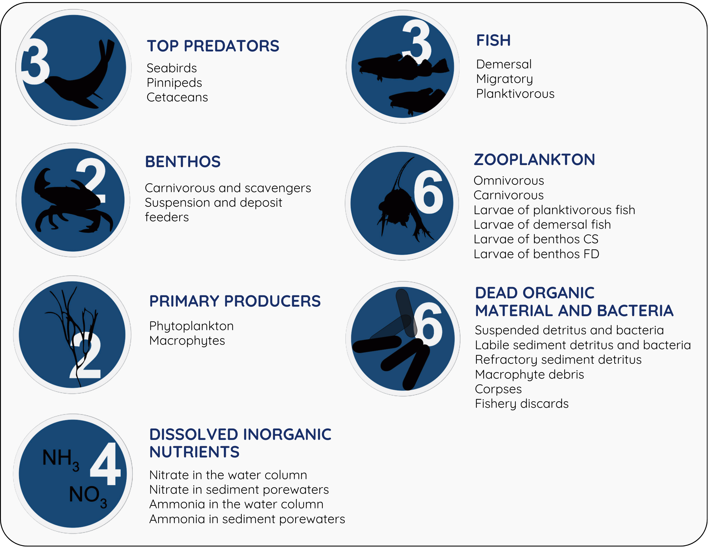
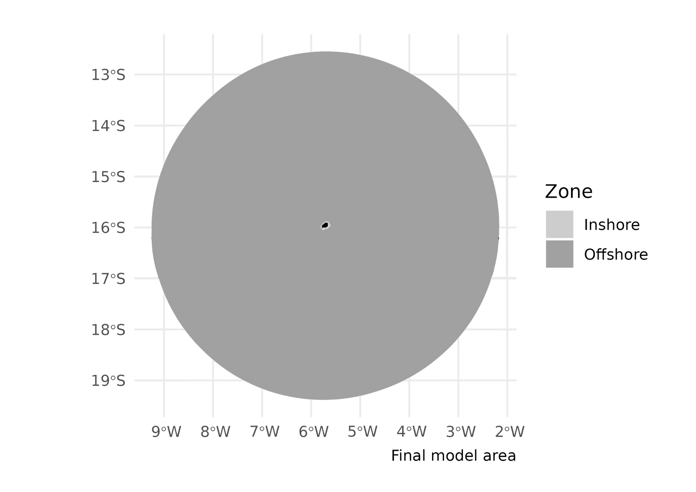
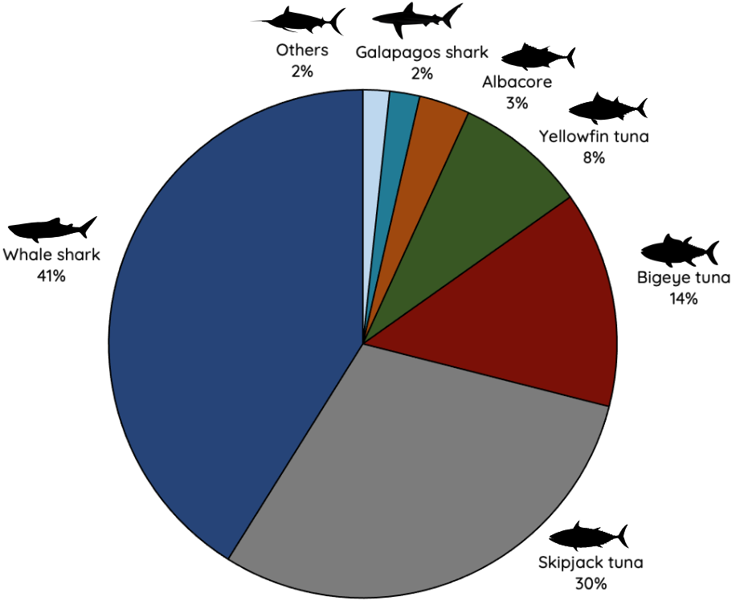
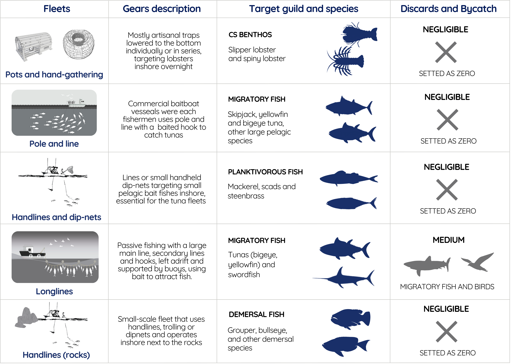
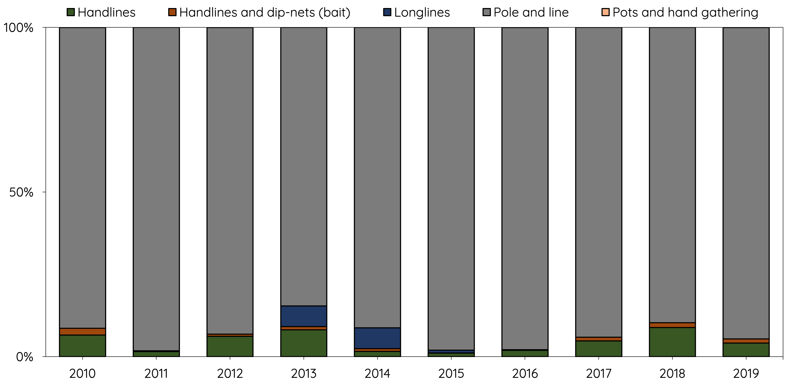

```{r setup, include=FALSE}

knitr::opts_chunk$set(echo = FALSE, warning = FALSE, message = FALSE, fig.align = "left")

library(tidyverse)
library(sf)
library(gt)

source("@_Region file.R")
Period <- "2010-2019"

table_nums <- captioner::captioner(prefix = "Table ")

table.ref <- function(x) stringr::str_extract(table_nums(x), "[^:]*")

model <- StrathE2E2::e2e_read(implementation, Period, models.path="Files") # Load implementation

Area <- read.csv(str_glue("Files/{implementation}/{Period}/Param/event_timing_SAINT_HELENA.csv")) %>% 
  filter(str_detect(Description, "km2")) %>% 
  .$Value                                                     # Get size of the model domain

Area
```

# Introduction {.unnumbered}

This document describes the configuration of StrathE2E for the Saint Helena Island off the South Mid-Atlantic Ridge and its parameterisation to enable stationary state fitting for both the baseline period (2010-2019) and future projections (2020-2070). These represent contrasting periods of environmental conditions.

Volumetric and seabed habitat data define the physical configuration of the system. We regard these as being fixed in time. Similarly, we regard the physiological parameters of the ecology model as being fixed in time. Some of these are set from external data. The remainder are fitted, as detailed here. Changes in the model performance between the different time periods therefore stem from the hydrodynamic, hydro-chemical and fishery driving data. These are detailed in the ecological drivers and fishing fleet sections.

In the StrathE2E model all marine lifeforms are explicitly or implicitly accounted for, but aggregated into coarse groups or 'guilds' defined mainly by feeding characteristics and diet preferences (Figure \@ref(fig:guilds). All state variables, except macrophytes, are expressed solely in terms of nitrogen mass. For more information about the StrathE2E model check the [documentations](http://www.marineresourcemodelling.maths.strath.ac.uk/strathe2e/) available.

```{r guilds, echo=FALSE, fig.cap="Ecological guilds of the StrathE2E model (Heath, 2021)", out.width = '100%'}

```

> Department of Mathematics and Statistics, University of Strathclyde, Glasgow, UK, E-mail: [m.heath\@strath.ac.uk](mailto:m.heath@strath.ac.uk){.email}
>
> Oceanographic Institute, University of Sao Paulo, Brazil, E-mail: [juliapetroski\@usp.br](mailto:juliapetroski@usp.br){.email}
>
> The code written to support this parameterisation is available on [github](https://github.com/Jack-H-Laverick/MA.SaintHelena).

<br>

# Model Domain {.unnumbered}

Santa Helena (15.96°S, 5.70°W) is a remote volcanic island, part of the British Overseas Territory of Saint Helena, Ascension, and Tristan da Cunha, with its top 800m rising above sea level (Carleton et al., 2010). In 2016, Saint Helena was designated as a sustainable-use Marine Protected Area (MPA; Johnson et al., 2019) that encompasses its entire Exclusive Economic Zone (EEZ; Booth and Azar, 2009).

The model splits the domain into three zones, inshore/shallow, offshore/shallow, and offshore/deep (Figure \@ref(fig:overhang)). The inshore/shallow zone covers waters shallower than 60 m or within 4.5 km from shore. The offshore zone encompasses the remaining area of the model domain and is further divided into a shallow and a deep layer. The shallow layer represents water from the surface to 60 m depth, and shares a boundary with the inshore shallow zone. The offshore/deep zone covers the same area as the offshore/shallow zone, but represents water between 60 m and 600 m deep. There is a second internal boundary between the two offshore zones.

```{r overhang, echo=FALSE, fig.cap="The spatial structure of StrathE2E; Ocean volumes and seafloor habitats. StrathE2E is built around a simplified spatial structure which represents shelf seas. These spatial units are connected to each other and to boundaries as shown to the right. The volumes connected to each spatial component are highlighted in blue.", out.width = '100%'}
knitr::include_graphics("img/overhang.png")
```

The seafloor within the StrathE2E model can be classified into eight habitat types. These include three sediment classes: fine (muddy, 1), medium (sandy, 2), and coarse (gravel, 3), with the fourth class (rock, 0) indicating the absence of soft sediment. These sediment classes are defined in both the inshore/shallow and offshore/deep zones.

[Habitat maps inshore for Saint Helena to be defined]

As of V.4, StrathE2E2 can represent an offshore "overhang" where open ocean does not contact the seafloor (Figure \@ref(fig:overhang)). The perimeter of the offshore zone in the model domain is the edge of the MPA, with a "false bottom" (overhang) that exchanges with the deep sea. By using the MPA to define the model domain, we accurately represent the protected status of Saint Helena Island, which also corresponds to the Exclusive Economic Zone (EEZ). The total area of the model is 444,901 km².

```{r domain, echo=FALSE, fig.cap="Map of the model domain. StrathE2E defines seabed sediment habitats as inshore (light gray) or offshore/overhang (dark gray). Within each zone, three sediment classes can be represented -- fine (muddy, 1), medium (sandy, 2) and coarse (gravel, 3). A fourth class (rock, 0) represents an absence of soft sediment. Note that the majority of the Saint Helena model domain is comprised by the 'overhang', which does not contact the sea floor.", out.width = '100%'}

```

# Fixed Physical {.unnumbered}

## Background {.unnumbered}

#### Water column inshore/shallow and offshore/deep zone area proportions and layer thicknesses; seabed habitat area proportions and sediment properties: {.unnumbered}

The depth boundary between deep and shallow layers was determined using vertical diffusivity values from NEMO-MEDUSA [@yool13] and mixed layer depth from Globcolour (www.globcolour.info/). The shallow-deep layer division was set at 60 m, with a bottom depth of 600 m for the deep layer. The offshore zone then extends to the edge of the EEZ, but with a "false bottom" that exchanges with the deep sea (without seafloor). In the coastal zone, the polygon is defined for areas shallower than 60 m or within 4.5 km of the coast.

#### Parameters for relationship between median grain size, sediment porosity and permeability. Permeability is used as the basis for estimating hydraulic conductivity which is a parameter in the representation of sediment processes in the model: {.unnumbered}

Porosity (proportion by volume of interstitial water) and permeability of each sediment habitat were derived from median grain sizes using empirically-based relationships.

$$log_{10}(porosity) = p_3 + p_4\left(\frac{1}{1+e^{(\frac{-log_{10}(D_{50})-p_1}{p_2})}}\right)$$ D~50~ = median grain size (mm); parameters p~1~ = -1.227, p~2~ = -0.270, p~3~ = -0.436, p~4~ = 0.366 [@heath21]

$$permeability = 10^{p_5}∙D_{50}^{*p_6}$$

where D~50~\* = 0.11 ≤ D~50~ ≤ 0.50 p~5~ = -9.213, p~6~ = 4.615 [@heath15].

These relationships are coded into the StrathE2E2 R-package with the parameters in the csv setup file for the Saint Helena model. The parameters are probably a reasonable starting point for any future model of a new region. Derivation of the parameters is described in the following text sub-sections.

#### Parameters for in-built relationship between sediment mud content, and slowly degrading (refractory) organic nitrogen content of seabed sediments (see description in this document): {.unnumbered}

Values for each sediment type derived from parameterised relationships between total organic nitrogen content of sediments (TON%, percent by weight), mud content (mud%, percent by weight) and median grain size (D~50~, mm).

$$mud\% = 10^{p_7}∙𝐷_{50}^{𝑝_8}$$ p~7~ = 0.657, p~8~ = -0.800

$$TON\% = 10^{𝑝_9}∙mud\%^{𝑝_{10}}$$

p~9~ = -1.965, p~10~ = 0.590

Proportion of TON estimated to be refractory = 0.9

These relationships, along with their parameters, are documented in the North Sea implementation of the StrathE2E2 package [@heath21]. While there may be regional variations, these relationships serve as a reasonable starting point for the Saint Helena implementation. The StrathE2E2 R-package encodes these relationships, with the parameters specified in the CSV setup file. Derivation of the parameters is described in the following sub-sections.

## Model area proportions {.unnumbered}

```{r area_proportions_cap}

tab_area_proportions_cap <- table_nums(name = "tab_area_proportions", 
    caption = stringr::str_glue("Area-proportions of the inshore and offshore zones and the thicknesses of the                                        water column layers. The sea surface area of the model domain is an estimated                                         {Area} km^2^."))
```

[Copied from Ascension, still needs compilation for Saint Helena]

`r table_nums("tab_area_proportions")`

```{r area_proportions}

tibble(Property = c("Sea-surface area proportion",
                        "Upper layer thickness (m)",
                        "Lower layer thickness (m)"),
           `Inshore/shallow` = c(model[["data"]][["physical.parameters"]][["x_shallowprop"]], 
                                 model[["data"]][["physical.parameters"]][["si_depth"]], 
                                 NA),
           `Offshore/deep` = c(1 - model[["data"]][["physical.parameters"]][["x_shallowprop"]], 
                               model[["data"]][["physical.parameters"]][["so_depth"]], 
                               model[["data"]][["physical.parameters"]][["d_depth"]])) %>% 
  gt() %>% 
  fmt_number(columns = c("Offshore/deep", "Inshore/shallow"), decimals = 4, use_seps = FALSE)


```

```{r habitat_proportions_cap}

tab_habitat_proportions_cap <- table_nums(name = "tab_habitat_proportions", 
    caption = stringr::str_glue("Area proportions and other characteristics of the seabed habitat classes defined in the model by depth, rock or sediment type. The sea surface area of the model domain is an estimated {Area} km^2^. Grain size is the median in mm, Permeability in units of m^2^, nitrogen content in %dw."))
```

`r table_nums("tab_habitat_proportions")`

```{r habitat_proportions}

physical <- read.csv(str_glue("Files/{implementation}/{Period}/Param/physical_parameters_ASCENSION.csv"))
  
proportions <- which(str_detect(physical$Description, "Area_proportion"))
porosity <- which(str_detect(physical$Description, "Defined_porosity"))
permeability <- which(str_detect(physical$Description, "Defined_permeability"))
nitrogen <- which(str_detect(physical$Description, "Defined_total_N"))
grain <- which(str_detect(physical$Description, "grain_size"))

depth_vector <- c(rep(c("Shallow"), each = 4), rep(c("Deep"), each = 5))
zone_vector <- c(rep(c("Inshore"), each = 4), rep(c("Offshore"), each = 5))

data_frame(Habitat = c("S0", "S1", "S2", "S3", "D0", "D1", "D2", "D3", "OV"),
           Depth = depth_vector,
           Zone = zone_vector,
           Sediment = rep(c("None (Rock)", "Fine", "Medium", "Coarse", "None (Rock)", "Fine", "Medium", "Coarse", "Overhang")),
           `Area Proportion` = physical$Value[proportions],
           `Grain size` = c(0, physical$Value[grain[1:3]], 0, physical$Value[grain[4:6]], NA),
           Porosity = c(NA, physical$Value[porosity[1:3]], NA, physical$Value[porosity[4:6]], NA),
           Permeability = c(NA, physical$Value[permeability[1:3]], NA, physical$Value[permeability[4:6]], NA),
           `Nitrogen content` = c(NA, physical$Value[nitrogen[1:3]], NA, physical$Value[nitrogen[4:6]], NA)) %>% 
  group_by(Zone, Depth) %>% 
  gt() %>% 
  fmt_number(columns = c("Area Proportion", "Grain size", "Porosity", "Permeability", "Nitrogen content"), 
                         decimals = 4, use_seps = FALSE) %>% 
  cols_align(align = 'center',
             columns = c(`Area Proportion`, `Grain size`, Porosity, Permeability, `Nitrogen content`)) %>% 
  tab_options(row_group.background.color = "whitesmoke")


```

## Daily disturbance rates {.unnumbered}

[Copied from SBS, still needs compilation for SPSP]

To calculate the natural disturbance rate, we needed depth-averaged current speeds (including tidal influence) and wave data. We used data products from Copernicus Marine Data; however, only surface tide components were available instead of depth-averaged values, and the depth-averaged current speeds did not include tides. Therefore, we approximated the influence of tides on the depth profile by assuming that the extra surface speed diminishes with depth at a certain decay rate. We employed a rough approximation for non-stratification and a flat bottom from the National Oceanography Centre (NOC). The equation assumes a constant speed in the upper half of the water column and attenuation in the lower half due to bottom friction, with speed decaying to zero at the bottom.

$$U_{} = U_{\text{current}} + \frac{U_{\text{tides }}}{1.07}$$ $$V_{} = V_{\text{current}} + \frac{V_{\text{tides }}}{1.07}$$

We used the Copernicus toolbox for subsetting the specific variables, the SBS domain, and the desired period via Command Line Interface (CLI), then post-processed the data in R. Since the Copernicus Marine Data Store only hosts recent data for public download, we used data from 2022, the oldest full annual cycle available with all three variables. Details about the products used below.

Waves: We used the Global Ocean Waves Analysis product (DOI: 10.48670/moi-00017) with a 1/12-degree resolution. The parameters used every 3 hours were: significant wave height, mean wave direction, and primary swell wave period. Specific variables included Sea surface wave significant height (VHM0, m), Sea surface wave direction (VMDR, °), and Sea surface primary swell wave mean period (VTM01SW1, s).

Currents: We used the Global Ocean Physics Analysis and Forecast product (DOI: 10.48670/moi-00016) with a 1/12-degree resolution. The 6-hourly parameters used were Eastward sea water velocity (uo, m/s) and Northward sea water velocity (vo, m/s).

Tides: We used the Global Ocean Physics Analysis and Forecast product (DOI: 10.48670/moi-00016) with a 1/12-degree resolution. The 1-hourly parameters used were Surface sea water x velocity due to tide (utide, m/s) and Surface sea water y velocity due to tide (vtide, m/s).

Even though the grid is shared, there were coastal cells with currents but missing data for waves and tides. We interpolated missing coastal cells using the Voronoi tessellation method (nearest neighbor). We also interpolated the depth-averaged currents and waves to match the hourly timestep of the tides using the `approx` function.

We combined all data into a single dataset and applied functions from the `bedshear` package to calculate bed shear stress for the six habitat types.

## Sediment porosity {.unnumbered}

Log-transformed porosity has been shown to have a sigmoidal relationship with log~10~(median grain size) (D~50~, mm) [@wilson18]:

$$log_{10}(porosity) = p_3 + p_4\left(\frac{1}{1+e^{(\frac{-log_{10}(D_{50})-p_1}{p_2})}}\right)$$

We use this relationship to calculate porosity for sea bed sediments in the Saint Helena (`r table.ref("tab_habitat_proportions")`), using an alternative parameterisation to Wilson [@pace21]. This alternative set of parameters extends the relationship to fine, muddy sediments (`r table.ref("tab_porosity")`).

```{r porosity_cap}

tab_porosity_cap <- table_nums(name = "tab_porosity", 
    caption = "The four parameters for the function relating sediment porosity to median grain size. From Pace et al. (in review)")
```

`r table_nums("tab_porosity")`

```{r tab_porosity}

d50_to_pore <- which(str_detect(physical$Description, "porosity_and_grainsize"))

data_frame(Parameter = paste0("P", 1:4),
           `Fitted value` = physical$Value[d50_to_pore]) %>%
  pivot_wider(names_from = Parameter, values_from = `Fitted value`) %>% 
  gt()

```

## Hydraulic conductivity {.unnumbered}

Hydraulic conductivity (H, m.s^-1^) represents the ease with which fluids flow through the particle grain matrix. The related term 'permeability' (m^-2^) is a measure of the connectedness of the fluid filled void spaces between the particle grains. Permeability is a function only of the sediment matrix, whilst conductivity is a function of both the sediment and the permeating fluid, in particular the fluid viscosity and density. Hydraulic conductivity is related to permeability by:

$$H = Permeability∙fluid\;density∙\frac{𝑔}{dynamic\;viscosity}$$ where: seawater density = 1027 kg.m^-3^ at salinity 35 and temperature 10°C; seawater dynamic viscosity = 1.48 x 10^-3^ kg.m^-1^.s^-1^ at salinity 35 and temperature 10°C; g = acceleration due to gravity = 9.8 m.s^-1^

Hence, $H = Permeability · 6.8004·10^6$ (m.s^-1^ at salinity 35 and temperature 10°C)

Whole sediment permeability can be related to the proportion of sediment classed as mud (D~50~ \< 62 μm) [@pace21]. In this model implementation, this relationship is utilized for internal calculations.

## Sediment organic nitrogen content {.unnumbered}

The magnitude of the static (refactory) organic nitrogen detritus pool in each sediment type is a required input to the model. The code includes an option to impute values from empirical relationships between total organic nitrogen (TON) and mud content, and between mud content and median grain size. This relationship has been documented in the North Sea implementation [@heath21]. For the Saint Helena implementation, the total nitrogen content is internally calculated and based on that relationship.

# Fixed biological {.unnumbered}

## Configuration parameters {.unnumbered}

### Assimilation efficiencies for each living guild in the model. {.unnumbered}

Fixed parameters defining the proportion of ingested mass of food that contributes to new body tissue, after subtracting defecation and the metabolic costs of digestion and synthesis [@heath12].

### Biomass loss rates due to temperature-dependent metabolism for each living resource guild. {.unnumbered}

Proportion of biomass lost to ammonia per day due to non-feeding related metabolism at a given reference temperature. Rates for individual guilds broadly related to typical body mass of representative species. Temperature dependency following a Q~10~ function.

### Q~10~ values for temperature dependent processes, and the Q~10~ reference temperature. {.unnumbered}

Separate Q10 values for autotrophic uptake of nutrient, heterotrophic feeding, and heterotrophic metabolism based on literature data.

### Light intensity required to saturate autotrophic nutrient uptake. {.unnumbered}

Light saturation intensity for nutrient uptake cannot be treated as a fitted value since it is confounded with other uptake parameters. Value estimated from survey of laboratory experiments.

### Annual weight specific fecundities of planktivorous and demersal fish guilds and the two benthos guilds in the model (suspension/deposit feeders and carnivore/scavenge feeders). {.unnumbered}

Guild-level values derived by surveying the literature.

### Harvestable biomass density threshold for each resource guild. {.unnumbered}

The living resource guilds in the model represent a mixture of harvestable and non-harvestable species, especially the invertebrate guilds. The density threshold parameter sets a limit for the guild biomass below which the harvestable species are assumed to be exhausted. Values set from analysis of trawl, plankton and benthos survey species biomass compositions.

### Minimum inedible biomass of carnivorous zooplankton. {.unnumbered}

The carnivorous zooplankton guild is a key component of the food web, predated on by all the fish and top-predators. However it represents an extremely diverse range of fauna many of which are not edible in significant quantities by the guild predators, e.g. scyphomedusae. A minimum edible threshold is set to ensure that the guild as a whole cannot be extirpated by predation. The value is a rough estimate of scyphomedusae biomass.

## Event timing parameters (not fitted) {.unnumbered}

### Spawning and recruitment start and end dates for fish and benthos {.unnumbered}

We gathered the spawning and recruitment periods for each guild based on literature regarding the main species, described below. In the model the annual weight-specific fecundity is assumed to be shed uniformly between the start and end dates of spawning. The annual cohort of larvae/juveniles of each fish and benthos guild is assumed to recruit to the settled stage at a uniform daily rate between the start and end dates.

#### Planktivorous {.unnumbered}

We did not find specific data regarding the reproductive period of planktivorous species in Saint Helena. Therefore, we inferred a spawning period during the austral spring and summer, with recruitment occurring in autumn and winter, based on data from small pelagics at the Saint Peter and Saint Paul Rocks (see SPSP model implementation). The spawning period for the planktivorous guild was set from December 1st to March 31st, and recruitment from April 1st to June 30th.

#### Demersal {.unnumbered}

The reproductive period for the demersal guild was determined based on the spawning patterns of the rock hind grouper (*Epinephelus adscensionis*), a species of ecological and fisheries significance in Saint Helena Island. Most species within the subfamily Epinephelinae form spawning aggregations and have extended spawning periods during the winter and spring months (Edwards, 1990). On Saint Helena and Ascension Island, the spawning season spans from June to November, with a peak in August, coinciding with the austral winter (Edwards, 1990; Ascension Island Government, 2016; Nolan et al., 2017). Fishers in Saint Helena also report that grouper are difficult to catch in winter months, another indicator of the spawning period (Riley et al., 2020). In the absence of specific recruitment data, we set the recruitment period to start 90 days after the end of spawning and continue for 150 days.

#### Carnivorous and scavengers benthos {.unnumbered}

Reports from the Saint Helena Island government indicate that lobsters enter early reproductive stages from October 1st to December 31st, with a closed fishing season from January to the end of March due to the advanced reproductive stages of the brown spiny lobster (*Panulirus echinatus*) and stump lobster (*Scyllarides obtusus*) (St Helena, 2012; 2022).

Based on this information, the spawning period for the carnivorous and scavenging benthos guild was set from January 1st to March 31st, with the recruitment period from April 1st to June 30th. In the absence of specific recruitment data, we assumed recruitment to begin 30 days after the spawning period ends, lasting for 120 days.

#### Deposit and filter benthos {.unnumbered}

Research on the reproductive activities of deposit and filter benthos in the Saint Helena region is limited. We adopted the same spawning and recruitment periods used for the DF benthos guild in the South Brazil Bight implementation (See X source): spawning period from September 1st to February 1st and recruitment from August 1st to January 1st.

### Extra-domain stock biomass of migratory, and the proportion invading the domain each year. Start and end dates for the annual invasion, and start and end dates for the emigration. (see description below). {.unnumbered}

The migratory fishes in the region are part of a broader Atlantic stock and perform transatlantic movements. These species utilize multiple spawning grounds and are not present in the Atlantic year-round. Key migratory species making seasonal transits through Saint Helena waters include skipjack tuna (*Katsuwonus pelamis*), bigeye tuna (*Thunnus obesus*), and yellowfin tuna (*Thunnus albacares*), along with other tuna-like species and sharks. The data on the biomass of these migratory fish stocks, the proportion entering the Saint Helena Island EEZ, and the timing of their migrations are derived from literature and stock assessments, as detailed below.

## Event timing parameters (fitted) {.unnumbered}

Saint Helena likely serves as a feeding ground for sub-adult fish, which migrate to spawning grounds upon reaching maturity (Wright et al., 2020). Bigeye tuna and yellowfin tuna primarily spawn in tropical waters, such as the Gulf of Guinea and the Gulf of Mexico, during the summer (Carleton et al., 2010). In the Saint Helena EEZ, yellowfin tuna landings exhibit no significant seasonality, while bigeye tuna are more prevalent between September and December, skipjack from December to June, and albacore from July to September (Wright et al., 2020).

Recent tagging studies on yellowfin tuna show that they remain in Saint Helena waters for extended periods, ranging from six months to a year, during which they feed and grow (Wright et al., 2020). They are typically recruited into the fishery between February and April each year and leave the population upon reaching a length of 120 cm (Wright et al., 2020). Yellowfin tuna reach an average size of 96 to 120 cm at Cardno Seamount in May/June, suggesting migration out of the EEZ at this size (Wright et al., 2020; Wright et al., 2021). Additionally, yellowfin tuna exhibit high fidelity to the area and remain in St. Helena waters for extended periods due to elevated productivity levels associated with the island and seamounts (White et al., 2007; Wright et al., 2021; Wright et al., 2019). Recapture rates of conventionally tagged fish ranged from 12% (2017) to 30% (2015), with an overall average recapture rate of 19%.

The immigration period is set from September 1st to November 30th, and the emigration period from June 1st to July 31st, based on the months of highest presence of migratory fish described above. We also assumed that 20% of the population remains within the Saint Helena EEZ even during the immigration period.

We assumed that there is no feedback between fishing and environmental conditions and the biomass and migration patterns. In this version of StrathE2E the timing of immigration and emigration, and the mass influx across the ocean boundary during the annual immigration phase are treated as period-specific external driving data.

To estimate the proportion of migratory stocks entering the Saint Helena domain, we conducted a rough estimation of their biomass in both the Atlantic Ocean and the Saint Helena EEZ.

Among the tuna species in the region, yellowfin tuna is the only one with a biomass assessment as, to date, tagging was insufficient to assess the local biomass of skipjack, albacore, and bigeye tuna within St. Helena's EEZ (Wright et al., 2020). Biomass estimates from tagging recoveries by Wright et al. (2020) between 2016 and 2019 ranged from 1,370 to 2,935 tons, with an average of 1,916 tons of yellowfin tuna biomass across three key fishing grounds in Saint Helena. The ICCAT target exploitation rate (FMSY) for yellowfin tuna is 16% (ICCAT, 2019), and the local exploitation rate aligns with this, given the current TAC of 300 tons. This suggests a yellowfin biomass of approximately 1,875 tons, which closely matches the 1,916-ton estimate. Therefore, we used the baseline yellowfin biomass of 1,916 tons.

For skipjack tuna, St. Helena typically accounts for 0.42% of the East Atlantic skipjack stock landed within its EEZ (Wright et al., 2020). Our calculations are based on the proportion of catch in the Eastern Atlantic during the baseline period, utilizing biomass estimates from Sea Around Us (SAU) stock assessments, which primarily rely on ICCAT data and the CMSY method (Pauly et al., 2020). Covering the period from 2010 to 2018, we averaged this proportion and applied to the TAC of 750 tons per year in St. Helena to obtain a rough estimate of the biomass.

For bigeye tuna, the most recent ICCAT assessment (ICCAT, 2021) indicates that the stock is overfished but not currently undergoing overfishing, following international landing reductions in 2018. The TAC for the UK overseas territories was initially set at 1,000 tons, though local authorities in Saint Helena questioned whether local bigeye stocks could sustain such a catch (Wright et al., 2020). Consequently, in 2020, the TAC was reduced to 600 tons. To estimate bigeye tuna biomass, we applied the ICCAT target exploitation rate of 19% to the most recent TAC.

The maximum sustainable yield (MSY) for albacore was 25,900 tons, with a relative fishing rate of F2014/FMSY at 0.54. ICCAT set the South Atlantic TAC for albacore at 24,000 tons (ICCAT, 2021), with the local TAC for St. Helena at 100 tons (REC 16-07), which accounts for 0.42% of the total. During the same period, the biomass was estimated at approximately 132,500 tons (ICCAT, 2020). Applying the 0.42% catch proportion to the biomass provides an estimate of the annual local albacore biomass.

Beyond tuna species, other significant migratory species in the region include swordfish (*Xiphias glaudis*). Although swordfish landings and sales are prohibited in St. Helena due to high mercury levels (TAC St. Helena, 2020), ICCAT sets a TAC of 25 tons for the UK overseas territories. The South Atlantic TAC for swordfish is 14,000 tons, with St. Helena's share corresponding to 0.18%. The estimated local swordfish biomass was 57,474 tons. Similar estimates for wahoo (*Acanthocybium solandri*), blue marlin (*Makaira nigricans*), and shortfin mako shark (*Isurus oxyrinchus*) were calculated using SAU data and catch-to-biomass ratios for the Atlantic stock between 2010 and 2018, and these were applied to the current TAC or reported catches in St. Helena where no TAC exists. For the galapogos shark *Carcharhinus galapagensis* and the white marlin *Kajikia albida*, we used the average local biomass estimates from the SAU assessment covering the period from 2010 to 2018.

Beyond tuna species, other significant migratory species in the region include swordfish (*Xiphias glaudis*). Although swordfish landings and sales are prohibited in St. Helena due to high mercury levels (TAC St. Helena, 2020), ICCAT sets a TAC of 25 tons for the UK overseas territories. The average swordfish catch in the South Atlantic was 14,000 tons, and applying the same catch-to-biomass ratios we obtained a local swordfish biomass of 159.29 tons. Similar estimates for wahoo (*Acanthocybium solandri*), blue marlin (*Makaira nigricans*), and shortfin mako shark (*Isurus oxyrinchus*) were calculated using SAU data and catch-to-biomass ratios for the Atlantic stock between 2010 and 2018, and these were applied to the current TAC or reported catches in St. Helena where no TAC exists. For the galapagos shark *Carcharhinus galapagensis* and the white marlin *Kajikia albida*, we used the average local biomass estimates from the SAU assessment covering the period from 2010 to 2018.

For whale sharks (*Rhincodon typus*), which are not fished but are seasonally abundant in Saint Helena from December to May each year (Perry et al., 2020), 277 individual sharks were identified through photographic identification between 2013 and 2019 (Perry et al., 2020). We used this number as a reference, estimating their biomass by multiplying the average weight from FishBase.

Our estimates suggest an annual migratory fish biomass of X tons per km², totaling 22,913 tons within the Saint Helena EEZ. Our biomass estimates for the 12 main stocks in the Atlantic region occurring around Saint Helena totaled 3,275,099.7 tons. The proportion of the migratory stock entering the model domain was calculated to be 0.7%. For tuna species alone, we estimated a proportion of 0.41%, consistent with the reported catch proportions from Saint Helena relative to total Atlantic catches. Figure \@ref(fig:migratory)) shows the dominant species in the Saint Helena Island EEZ in terms of biomasses compiled here.

```{r migratory, echo=FALSE, fig.align='center', fig.cap="Proportion of biomasses by species of the assessed migratory guild in the Saint Helena EEZ", out.width = '50%'}

```

The model setup code calculates the parameters which are needed in the ecology model. These are the only fixed (i.e. non-fitted) ecology model parameters which are period-specific.

```{r migrant_cap}

tab_migrant_cap <- table_nums(name = "tab_migrant", 
    caption = "Biological event timing parameters, constant across the time periods. The data are processed in the model setup to calculate the immigration flux parameters needed in the ecology model. Spawning and recruitment durations were established assuming a month with 30 days.")
```

`r table_nums("tab_migrant")`

```{r tab_migrant, fig.cap = tab_migrant_cap}

data_frame(Parameter = model[["data"]][["biological.events"]][["Description"]] %>% 
                        str_replace_all("_", " "),
           Value = model[["data"]][["biological.events"]][["Value"]]) %>% 
  .[1:17,] %>% 
  gt() %>%
  fmt_number(
    decimals = 0,
    use_seps = FALSE
  )

```

\newpage

`r table_nums("tab_migrant", display = "cite")` Continued.

```{r tab_migrantb}

data_frame(Parameter = model[["data"]][["biological.events"]][["Description"]] %>% 
                        str_replace_all("_", " "),
           Value = model[["data"]][["biological.events"]][["Value"]]) %>% 
  .[18:26,] %>% 
  gt() %>%
  fmt_number(
    decimals = 2,
    use_seps = FALSE
  )
```

# Ecological drivers {.unnumbered}

Monthly resolution time-varying physical and chemical driving parameters for the model were derived from a variety of sources:

-   Temperature, vertical mixing coefficients, volume fluxes, and boundary nutrient, detritus and phytoplankton concentrations from outputs of a NEMO-ERSEM coupled hydro-geochemical model run at SSP370 with a 2010-2019 historical/future split [@yool13].
-   Surface shortwave radiation, surface air temperature, and freshwater volume outflows from HadGEM2-ES model output [@jones11] used to force the NEMO-MEDUSA coupled hydro-geochemical model mentioned above [@yool13].
-   River nitrate and ammonia concentrations estimated from GRQA database (Global River Water Quality Archive, @virro21)
-   Atmospheric deposition of nitrate and ammonia from ISIMIP3a ([Inter-Sectoral Impact Model Intercomparison Project](https://data.isimip.org/10.48364/ISIMIP.759077.2); [@yang22])
-   Remote sensing data products on Suspended Particulate Matter (Globcolour L3b; <ftp://ftp.hermes.acri.fr/GLOB/merged/month/>).
-   Habitat disturbance due to tidal currents and waves from..
-   Wave height, period, and direction from the ERA-5 reanalysis monthly means accessed through [CDS](https://cds.climate.copernicus.eu/cdsapp#!/dataset/10.24381/cds.f17050d7?tab=overview) for 1980-2021 [@Hersbach19].

Details of how these data were processed are given below, supported by the [nemomedusR](https://jack-h-laverick.github.io/nemomedusR/) packages.

### Vertical mixing coefficients between the upper and lower layers of the deep zone: {.unnumbered}

Vertical diffusivity from the NEMO-MEDUSA coupled hydro-geochemical model output [@yool13] was interpolated for each grid cell at the SDepth m boundary depth between the shallow and deep layers of the offshore zone. These values were summarised as monthly averages into period-specific climatological annual cycles of data for the simulation periods.

### Monthly averaged temperatures for each water column layer: {.unnumbered}

Derived by monthly averaging values at grid points within the inshore and vertical layers of the offshore zones from the NEMO-MEDUSA coupled hydro-geochemical model output [@yool13], weighted by grid point volumes. Values were summarised into period-specific climatological annual cycles of data for the simulation periods.

### Monthly averaged suspended particulate matter (SPM) concentrations (mg.m^-3^) in the shallow zone and the deep zone upper layer: {.unnumbered}

Monthly averaged values of inorganic suspended particulate matter in sea water are available from the Globcolour project, starting from September 1997. These data are derived from satellite observations using the algorithm of Gohin [-@gohin11]. Data were downloaded from the ftp server (<ftp://ftp.hermes.acri.fr/GLOB/merged/month/>). We summarised these values as zonal statistics for the model domain to acquire a climatological annual cycle of data for the 2010-2019 simulation period only.

### Monthly average light attenuation coefficients for the inshore and offshore surface layers: {.unnumbered}

Light attenuation in open water was parameterised from a linear relationship between the light attenuation coefficient and suspended particulate matter concentration (SPM) (Devlin et al., 2008).

### Monthly averaged daily integrated irradiance at the sea surface (E.m^-2^.d^-1^): {.unnumbered}

Derived from HadGEM2-ES model output [@jones11] which forces the NEMO-MEDUSA model run used throughout our implementation. Monthly mean values were summarised into a climatological annual cycle of data for the simulation periods.

### Monthly averaged daily atmospheric deposition rates of oxidised and reduced nitrogen onto the sea surface in the shallow and deep zones (mMN.m^-2^.d^-1^): {.unnumbered}

Sourced from the "histsoc" files for a 1901 - 2021 hindcast as monthly averages [@yang22], available from [CDS](https://cds.climate.copernicus.eu/cdsapp#!/dataset/10.24381/cds.f17050d7?tab=overview). Monthly values were summarised into climatological annual cycles of monthly oxidised and reduced nitrogen deposition rates extracted for 2010-2019. Projections under different SSPs are also available to 2100.

### Monthly averaged, freshwater river inflow rates (expressed as a daily proportion of the receiving layer volume), and concentrations of oxidised and reduced dissolved inorganic nitrogen in the inflowing river waters (mMN.m^-3^): {.unnumbered}

Freshwater inflow derived from HadGEM2-ES model output [@jones11] which forces the NEMO-MEDUSA model run used throughout our implementation. Monthly values were summaries into a climatological annual cycle of data for all periods.

### Volume fluxes into the model domain across open sea boundaries, and from the upper layer of the offshore/deep zone into the inshore/shallow zone, expressed as proportions of the receiving layer volume per day: {.unnumbered}

Monthly averaged daily inflow and outflow volume fluxes derived by integrating daily mean velocities directed perpendicular to transects along the model domain boundary at grid points in each depth layer along transects through outputs from the NEMO-MEDUSA coupled hydro-geochemical model output [@yool13]. Monthly averaged daily inflow volume fluxes then divided by the volume of the receiving layer in the model domain to estimate a daily flushing rate. Period-specific climatological annual cycles of data used for simulation periods.

### Mean concentrations of nitrate, ammonia, phytoplankton and suspended detritus (mMN.m^-3^), in adjacent ocean waters inflowing to the offshore/deep zone upper layer, adjacent ocean waters inflowing to the offshore/deep zone lower layer, and adjacent shelf waters inflowing to the inshore/shallow zone: {.unnumbered}

NEMO-MEDUSA outputs included phytoplankton and suspended detritus, as well as Dissolved Inorganic Nitrogen (DIN). We calculated the depth-averaged concentrations for pixels within the shallow and deep layers of StrathE2E. We then sampled the pixels using the same transects around the model domain as for sampling volume fluxes. Only transects where water flowed into the model domain were sampled, and the average concentration of inflowing waters for target variables was calculated weighting by the flow rate across a transect and the cross-sectional area represented by a transect (average depth and length). Concentrations were then averaged into climatological annual cycles for all periods.

The GRQA (@virro21) database was utilized, providing nitrate and ammonium concentrations in mg/l from continental and global observation datasets. Data were filtered for Brazilian rivers along the SBS coastline, and those inflowing to the inshore zone were selected. Outliers were identified using the IQR method. The resulting values were then transformed into monthly concentrations in mMN.m^-3^.

# Fishing fleet {.unnumbered}

## Background {.unnumbered}

The key configuration data for the fishing fleet model are the definitions of the gears in terms of their power with respect to each of the harvestable resource guilds, discards and bycatch rates, processing-at-sea rates, and seabed abrasion rates. These can be regarded as static parameters for each fleet. Fleets were defined based on available data from databases and literature, with some grouped according to similarities and potential Saint Helena EEZ policy and management scenarios. Species were categorized into the commercial guilds based on ecological properties using information from databases such as FishBase (Froese and Pauly 1999; <https://www.fishbase.se/>).

The fisheries of St. Helena EEZ are of small-scale, with a maximum of 40 fishermen (Carleton et al., 2010). Local management of these fisheries is overseen by the Directorate of Fisheries of the Government of St. Helena, adhering to the regulations established by the Island Government. On the international level, are under the ICCAT.

The main fishing in the Saint Helena EEZ targets tunas and other large pelagic fishes, with five species comprising the major landings: skipjack tuna (*Katsuwonus pelamis*), bigeye tuna (*Thunnus obesus*), yellowfin tuna (*Thunnus albacares*), albacore/longfin tuna (*Thunnus alalunga*), and wahoo (*Acanthocybium solandri*), making the migratory guild predominant in the fisheries data. Although St. Helena has never taken more than 0.2% of the Atlantic tuna landings, (Wright et al., 2020) fishing activities on the island are significant for the residents' food supply and cultural heritage (Rees et al., 2016).

Among the demersal fishes, the reef-associated rock hind grouper (*Epinephelus adscensionis*), deep-water bullseye (*Cookeolus japonicus*), glasseye snapper (*Heteropriacanthus cruentatus*), squirrelfish (*Holocentrus adscensionis*), parrotfish (*Bodianus insularis*), and blackbar soldierfish (*Myripristis jacobus*) are also valuable commercially and in recreational fisheries.

Planktivorous species including mackerel (*Scomber colias*), scads (*Decapterus macarellus*, *D. muroadsi*, and *D. punctatus*), and steenbrass (*Selar crumenophthalmus*) are vital as bait supply for offshore fishing activities (St. Helena Government, 2023).

Since 2016, only one-by-one fishing methods have been permitted within the St. Helena EEZ as part of the MPA Management Plan, being prohibited purse seine, bottom trawling, gillnets and others considered unsustainable fishing methods (Blue Belt, 2019; St. Helena Government, 2023). Based on the fleets that operated during the baseline period, we categorized the fishing data into five fleets: pole and line, handlines and dip-nets (bait), handlines, longlines, and pots and hand gathering.

The pole and line fleet, targeting tunas and other migratory fish, dominated the baseline period, accounting for 90% of the landings. In this method, tunas feeding at the surface are attracted by baited hooks cast from a stationary vessel (Wright et al., 2020). Due to its minimal bycatch, it is considered to be relatively low impact (Blue Belt, 2019). Trolling, a modification of the pole and line technique, involves towing live bait behind the fishing vessel on rods, and is also regularly used in St. Helena waters to target wahoo (St. Helena Government, 2012). Due to their similarities, we considered only the pole and line fleet, as the available effort data did not differentiate between the two methods.

Live bait is essential for the pole and line fleet, so the fleet targeting bait (small pelagic planktivorous species) was also included. Bait is caught using inshore line methods or small handheld dip-nets (Carleton et al., 2010; St. Helena Government, 2012).

The longlines fleet targets swordfish and tuna. Due to high shark bycatch levels, this fleet has been discouraged by the government since the baseline period and was prohibited in 2020 for not being a "one-by-one" fishing method (St. Helena Policy Statement, 2020). We included this fleet in the model as there are records of longline fishing during between 2010-2019.

In addition, there is handline fishing targeting species with low mobility, such as grouper, bullseye, and other nearshore demersal species (Rees et al., 2016). This method uses multiple baited hooks and usually occurs when tuna catches are poor or when the local market demands other species (St. Helena Government, 2023).

The pots and hand gathering fleet was grouped to represent the methods used for two species of lobster (St. Helena Government, 2016). For potting, bait (such as fish heads) is placed inside the lobster pot, which is left to soak overnight (St. Helena Government, 2023).

Thus, five fleets have been described and incorporated into the StrathE2E Saint Helena model \@ref(fig:fleets)). The data compilation methodology used is described below.

```{r fleets, echo=FALSE, fig.cap="Fishing fleets defined for the StrathE2E Saint Helena EEZ model, their operational descriptions, target-species and discards levels.", out.width = '110%'}

```

## Landings {.unnumbered}

Data from the Environment and Natural Resources Directorate (ENRD) includes annual landings per species. It is compiled by the Statistics Office of the St. Helena Government from various sources, including the Fisheries Corporation and the Agriculture and Natural Resources Department (<https://www.sainthelena.gov.sh/st-helena/statistics/>). This dataset contains information on 20 species distributed across migratory, demersal, planktivorous, and CS benthos guilds. The fleets were allocated to each species based on information from official government reports. When available, landings were also divided into inshore and seamount categories using the proportions provided in the CR087 report.

We also utilized data from the ICCAT, which records and stores pelagic fishing data. We filtered this data using the UK-Saint Helena flag in the T2CE (Task 2 -- Catch and Effort) database. We verified that the landing data for the period 2010-2019 for pelagic species matched those available in the ENRD database but were divided into two fleets: rod and reel, and longline. We considered the rod and reel fleet equivalent to the Pole and Line fleet in our model and used this division accordingly. The landing data were consistent with the official fisheries statistics of St. Helena, and we applied the same fleet divisions as those present in the ICCAT data, except for swordfish (*Xiphias gladius*), which was not present in the official St. Helena database for this period. For swordfish, we used the landing values from the ICCAT data.

```{r catchfleet, echo=FALSE, fig.align='center', fig.cap="Catches per year and per fleet compiled for the Saint Helena EEZ StrathE2E model.", out.width = '90%'}

```

## Discards {.unnumbered}

We considered that fishery discards in the St Helena fleets are minimal, primarily due to the use of "one-by-one" techniques, which allow fishermen to avoid unwanted species. According to Carleton et al. (2010), the pelagic fleets in Saint Helena occasionally incidentally catch cavally (*Pseudocaranx dentex*), dolphinfish (*Coryphaena spp.*), blue marlin (*Makaira nigricans*), and pelagic sharks. However, they report that, aside from some sharks, nearly all incidental catches are either sold or retained by fishermen for home consumption.

Gilman et al. (2017) evaluated discard rates in global tuna, tuna-like, and billfish fisheries by RFMO area and gear type. In the ICCAT area of the South Atlantic, no discard rate records were found for handline and pole and line tuna fisheries, which are also considered to have low or negligible discard rates by Kelleher (2005). Based on this, we considered the discard rates to be zero for both fleets.

Regarding the baitfish fishery, small-scale fisheries for small pelagics are considered to have low or negligible discard rates (Kelleher, 2005), and there are no non-target species in this fleet in St Helena according to Carleton et al. (2010). We also assumed there were no discards in the pot and hand-gathering fleets for lobster.

In contrast, longline fishing trials within Saint Helena's EEZ have reported significant bycatch levels, including blue sharks and other shark species, in addition to the target swordfish (Collins, 2017; Blue Belt, 2019). The FAO global database (Kelleher, 2005) indicates that smaller longliners, which typically have shorter trips, tend to retain more sharks and other non-target species, resulting in a discard rate of 15% for these vessels. Based on this, we adopted the discard rate of 15% for longlines for the migratory guild.

## Bycatch {.unnumbered}

There are no records of bycatch occurrence involving marine mammals or seabirds in the St Helena fleets. According to the St Helena Government (2020), there is no seabird mortality associated with pole and line or rod and line fishing. Seabirds such as boobies, noddies, and diving petrels do associate with fishing vessels and sometimes take live or cut bait, but no seabird bycatch was observed or reported in any UK Overseas Territories recently (ICCAT, 2022). Rough-tooth dolphins (*Steno bredanensis*) often take bait off hooks and can hinder fishing activities, but they are not adversely affected by fishing operations (Carleton et al., 2010). While the occasional seasonal harvesting of dolphins occurred until the 1970s, there is no evidence of any fishery-related cetaceans deaths in recent decades (Carleton et al., 2010).

However, it is anticipated that some seabird bycatch may occur in the longline fleets. We extrapolated seabird bycatch rates from similar fleets from another island in the SOMAR region, the Saint Peter and Saint Paul Archipelago (see X model implementation). We applied a mortality rate of 0.05 birds per day for longline fleets and 0.143 birds per day for handlines. These daily bird mortality rates were multiplied by the estimated fishing days for each fleet (see Section X.Y for fishing effort). To estimate bycatch in terms of biomass, we used the average weight of these species as reported in the literature. The total bycatch from both fleets was estimated at approximately 9 individual birds, equivalent to around 0.007 tonnes per year. This data was converted to mMN.m⁻².y⁻¹ using the appropriate conversion factor (see Greenstreet et al., 1996, Table X).

It is important to note that the methodology developed here is a simplification, designed only to parameterize the Saint Helena EEZ StrathE2E model. The annual bycatch data presented should not be regarded as a comprehensive assessment of bycatch in the region.

## Fishing effort and distribution {.unnumbered}

We utilized data from ICCAT, which records and stores pelagic fishing data, filtering for the UK-Saint Helena flag in the T2CE database (Task 2 -- Catch and Effort). We verified that the landing data for pelagic species from 2010-2019 matched those available in the ENRD. We used fishing effort in terms of fishing days for longline and line days (considered equivalent to fishing days) for rod and reel. The "Rod and Reel" gear category in the ICCAT database was renamed to "Pole and Line" to be consistent with the catch data. This resulted in an average of 1885.6 fishing days from 2010-2019 for the Pole and Line fleet targeting tuna and tuna-like species. We assumed 8 hours of fishing per day for conversion to fishing hours. For the longline fleet, we obtained an average of 30.67 fishing days from ICCAT records from 2013-2015 for longline targeting swordfish and tunas. We assumed 12 hours of fishing per day for conversion to fishing hours.

For the handline fleet, we considered the effort targeting primality the grouper present in the Blue Belt Programme report (Riley et al., 2020) from 2010 to 2019, obtaining an average of 60.5 fishing days per year.

For the baitfish fleet, there are no official records of effort. We made a rough estimate based on information from Collins et al. (2012) that each vessel would normally collect 20-30 kg of baitfish for a day's fishing. We used 25 kg per fishing day and the annual mackerel landing value from 2010-2019 (2.76 kg) to estimate approximately 110 fishing days per year.

There were no available indicators of the effort directed at lobster fishing on Saint Helena or Ascension, its closest neighbor. Therefore, we used estimates from another island in the SOMAR region, the Saint Peter and Saint Paul Archipelago. Freire et al. (2013) estimated approximately 10 kg of spiny lobsters per fishing day using traps. From 2010 to 2019, an average of 46 kg of lobsters were landed per year, roughly suggesting that five fishing days would be necessary annually.

The final unit for input into the model for each fleet was sec.mˆ-2ˆ.dˆ-1ˆ (`r table.ref("effort_tab")`).

```{r effort_cap}

tab_effort_cap <- table_nums(name = "tab_effort", 
    caption = stringr::str_glue("Effort compiled per fleet for the baseline period implementation of Saint Helena model"))
```

`r table_nums("tab_effort")`

```{r effort_tab}

effort_table <- data.frame(
  Fleets = c("Pole and line", "Longlines", "Handlines", "Handlines and dip-nets (bait)", "Pots and hand gathering"),
  `Effort (s.year-1)` = c("5.43E+07", "3.97E+05", "2.61E+06", "7.92E+05", "2.16E+05"),
  `Effort (s.m2-1.day-1)` = c("3.34E-07", "2.45E-09", "1.61E-08", "4.88E-09", "1.33E-09"),
  check.names = FALSE
)

effort_tab <- effort_table %>%
  gt() %>%
  tab_options(
    table.font.size = 11,
    column_labels.font.weight = "bolder"
  ) %>%
  cols_align(
    align = "center"
  ) %>%
  cols_label(
    Fleets = "Fleets StrathE2E Saint Helena",
    `Effort (s.year-1)` = html("Effort (s.year<sup>-1</sup>)"),
    `Effort (s.m2-1.day-1)` = html("Effort (s.m<sup>2</sup>.day<sup>-1</sup>)"),
  )

effort_tab
```

### Fleet Distribution per habitat {.unnumbered}

[to be completed]

According to Wright et al. (2020), the fisheries around St. Helena can be divided into two zones: the inshore area, extending within 30 nm of the island, and the offshore area, from 30 to 200 nm. The offshore zone encompasses key fishing grounds around the Bonaparte (west) and Cardno (north) seamounts, where migratory species are typically fished in the upper water column at depths of 75 to 200 meters (Carleton et al., 2010). While yellowfin and skipjack tuna are commonly caught in both inshore and offshore areas, bigeye and albacore tuna are mainly found in the deeper waters near the island and the seamounts (Wright et al., 2020). Thus, the pole-and-line fleet is divided into 31.66% offshore (seamounts) and 68.34% inshore. Most of the inshore tuna fishing occurs over coarse sediment (gravel), bedrock, and some sand.

In contrast, handline fishing for grouper and pot fishing for lobsters are confined to the inshore area and are not present around the Bonaparte and Cardno seamounts (Collins et al., 2012; Riley et al., 2020). These activities are associated with inshore rock substrates (Rees et al., 2016). Baitfish (Decapterus spp.) are caught with nets at the surface in waters 10 to 20 meters deep (Carleton et al., 2010), usually near sandy and rocky inshore beaches (Edwards, 1990).

Using this information and landings data categorized by area (from Wright et al., 2020), we allocated the fishing effort per habitat as outlined in Table X.

[to be completed]

## Seabed abrasion {.unnumbered}

We assumed no seabed abrasion rate (plough rate) per unit of time, as the fleets are mainly pelagic. The only fleet with contact with the seafloor is pots and traps, however the plough rate is minimum or no existent.

## Other processing {.unnumbered}

1.  Total catch by fleet and guild was calculated by combining landings with discard/bycatch values.

2.  Discarded weight was calculated as catch - landings.

3.  When catch was 0 discard rates were set to 1.

4.  Fishing power was calculated as catch / activity per fleet.

# Target data {.unnumbered}

Observed (target) data is used in the fitting process to train StrathE2E to return sensible values during the simulated annealing scheme (see the methodology implemented in StrathE2E in X and Y). Ecosystem state indices included in the optimisation process are data regarding the gross and net production of commercial guilds, PB ratios, fishery landings, bycatch, and other properties, located in the file "annual_observed_SAINT_HELENA.csv".

To optimize fishing gear activity rates we used target data concerning the harvest ratios (the proportion of exploitable biomass captured per day within each guild), fitting a scaling parameter for the effort-to-harvest ratio. The resultant values can be found in the files "region_harvest_SAINT_HELENA.csv" and "zonal_harvest_r\_SAINT_HELENA.csv".

## Production and PB ratios {.unnumbered}

Calculating the production involved compiling and adjusting biomass values for the model area and converting them to molar nitrogen mass following @greenstreet96. Subsequently, we convert the biomass for each species into gross production using PB ratios and converted them to molar nitrogen mass following @greenstreet96. The PB ratios sourced was also used as target data. For birds, cetaceans, and pinnipeds, net production was calculated using the relationship net production = 0.6 \* gross production.

In our literature search, we encountered a limited number of recent studies quantifying biomass in the Saint Helena EEZ, as described below. Details regarding the sources of biomass and PB ratios, along with the calculated values, are available in `r table.ref("production_tab")`.

```{r production_cap}

tab_production_cap <- table_nums(name = "production_tab",
    caption = "PB ratios utilized to estimate production as target data for each commercial guild in the model. Production values are presented in tonnes. The mMN conversion indicates the values used to convert the gross and net production from grams to molar nitrogen mass, using @greenstreet96. The final production is presented in units of millimoles of nitrogen per m^2^.")
  
```

`r table_nums("production_tab")`

```{r production_tab}

library(dplyr)
library(gt)

production_tab <- data.frame(
  Guild = c("Seabirds", "Cetaceans", "Migratory"),
  `P/B` = c(0.28,	"0.02-0.099",	1.3),
  `Production(t)` = c(2.43, 497.94, 4247569.84),
  `mMN convertion` = c(2.5157,	2.5157,	2.3145),
  `Production (mMN.m-2)` = c(0.00001372,	0.00168938,	0.153245),
  check.names = F
)

tab <- production_tab %>%
  gt() %>%
  fmt_number(
    columns = c(`P/B`, `mMN convertion`, `Production(t)`),
    decimals = 2,
    use_seps = FALSE
  ) %>%
  fmt_number(
    columns = c(`Production (mMN.m-2)`),
    decimals = 6,
    use_seps = FALSE
  ) %>%
  tab_options(
    table.font.size = 11,
    column_labels.font.weight = "bolder",
  ) %>%
  cols_align(
    align = "center"
  ) %>%
  cols_label(
    Guild = "Guild",
    `P/B` = "P/B",
    `Production(t)` = "Production(t)",
    `mMN convertion` = "mMN convertion",
    `Production (mMN.m-2)` = html("Production (mMN.m<sup>-2</sup>)")
  )
tab
```

### Top-predators {.unnumbered}

### Seabirds {.unnumbered}

Within the St. Helena EEZ, seventeen seabird species have been recorded, with nine species nesting on the offshore islands and mainland (St. Helena Government, 2023). The seabird community in St. Helena is relatively small compared to other tropical islands, such as neighboring Ascension Island, where the breeding seabird population is approximately two orders of magnitude larger (Oppel et al., 2015). While Ascension Island supports nearly one million nesting seabirds, population estimates for St. Helena suggest around 15,000 seabirds (Oppel et al., 2015). However, consistent monitoring of seabird biomass in St. Helena has not been conducted during the baseline period (Beard et al., 2023).

The breeding population of sooty terns (*Onchyprion fuscata*) on St. Helena is estimated to be between 1,200 and 1,400 individuals, while the population of red-billed tropicbirds (*Phaethon aethereus*) is approximately 540 individuals (Rowlands et al., 1998; Beard et al., 2023). Estimates from Rowlands et al. (1998) reported in Oppel et al. (2015) include 500 masked boobies (*Sula dactylatra*), 5,000 Madeiran storm petrels (*Oceanodroma castro*), and 1,000 white/fairy terns (*Gygis alba*). The population of brown noddies (*Anous stolidus*) is estimated at 200--400 pairs, while black noddies (*Anous minutus*) exceed 3,000 pairs (Prater, 2012). Occasional seabird species include the Pomarine skua (*Stercorarius pomarinus*) and the Arctic skua (*Stercorarius parasiticus*), with winter populations estimated at 10--30 and up to 100 individuals, respectively (Prater, 2012). Additionally, the St. Helena seabird monitoring program recently recorded 17 adult brown boobies (*Sula leucogaster*) (Beard et al., 2023).

Collectively, these figures suggest a seabird population of around 17,000 individuals. Furthermore, seven additional seabird species are classified as residents by the St. Helena Government (2023), though little information is available on their biomass or abundance. These species include *Bulweria bulwerii*, *Pelagodroma marina*, *Sula sula*, *Puffinus griseus*, *Puffinus lherminieri*, *Fregata ariel*, and *Fregata minor*. For the purposes of this study, we estimated a population of roughly 1,000 individuals for each of these species.

By multiplying the estimated number of individuals by the average weight of each species, as provided by BirdLife International (2024) and Sealife (X), we arrive at an approximate seabird biomass of 14.44 tons. This biomass estimate served as the basis for calculating seabird production in the Saint Helena EEZ, with a PB ratio of 0.28.

### Cetaceans {.unnumbered}

No biomass data are available for cetaceans in the St Helena EEZ. However, sighting data was used to roughly estimate population numbers, which were then converted to biomass using the average weight of females and males per species as reported by Christensen (2004). The cetacean community around St. Helena is relatively simple, comprising up to three resident species and seasonal species in nearshore waters, with additional species occasionally observed in deeper offshore areas (MacLeod and Bennett, 2007) .

The resident cetaceans species in St. Helena include the pantropical spotted dolphins (*Stenella attenuata*), the most abundant, and the bottlenose dolphins (*Tursiops truncatus*) and rough-toothed dolphins (*Steno bredanensis*) (MacLeod and Bennett, 2007). Humpback whales (*Megaptera novaeangliae*) visit St. Helena annually from June to December to give birth and rear their calves (Saint Helena Government, 2018; Clingham et al., 2013). The Sperm whales *Physeter catodon*, *Kogia breviceps* and *K. sima* are considered occasional visitors (Saint Helena Government, 2018)

MacLeod and Bennett (2007) observed large groups of *S. attenuata* seven times during a short-term survey, with a mean group size of 143 individuals, resulting in sightings of around 1,000 individuals. Dr. Perrin, as cited by Edwards (1990), estimated the population of *S. attenuata* around St. Helena to be between 1250 and 5000 individuals. Based on that, we considered 3125 individuals as the average annual pantropical spotted dolphins population. Martin et al. (2021) conducted marine mammal sightings during research cruises in St. Helena EEZ in 2018 and 2019, recording 254 pantropical spotted dolphins. By extrapolating this figure and considering an estimated population of 3,125, it suggests the actual population could be roughly 12 times the observed number due to the spatial and temporal limitations of the observations. Other cetaceans recorded by Martin et al. (2021) include 190 bottlenose dolphins (*T. truncatus*), 63 rough-toothed dolphins (*S. bredanensis*), three humpback whales (*M. novaeangliae*), 30 sperm whales (*P. catodon*), and 13 *Kogia spp*. Additional sighting databases report the presence of killer whales (*Orcinus orca*), false killer whales (*Pseudorca crassidens*), and southern right whales (*Eubalaena australis*), each observed once (Clingham et al., 2013). A conversion factor of 12 was applied to these sighting numbers due to the incomplete spatial and temporal coverage of the sightings.

This approach resulted in an estimated annual cetacean biomass of 8,762.44 tons, corresponding to a biomass density of 0.02 t/km². We used PB ratios from Morissette et al. (2009), applying 0.099/year for humpback whales, 0.05 for sperm whales, 0.02 for killer whales, and 0.047 for dolphins.

### Pinnipeds {.unnumbered}

According to Bester et al. (2021) vagrant southern elephant seals (*Mirounga leonina*) wandered farther north to St Helena in historical times but have not been recorded there more recently. In this way, our model does not include the Pinnipeds guild.

### Demersal fish {.unnumbered}

Biomass estimates for demersal fish within the Saint Helena EEZ are scarce in the literature and abundance data are most restricted to rock reefs such as in Cowburn et al. (2021). Consequently, we were unable to establish a target production value for demersal fish in the model. Stock assessments from SAU within the Saint Helena EEZ cover two commercially important demersal species: the deep-water bullseye (*Cookeolus japonicus*) and grouper (*Epinephelus adscensionis*), accounting for an annual biomass of 312.12 tons, which will be used to estimate the harvesting ratio for this guild in section X.

### Planktivorous fish {.unnumbered}

Small pelagic fish are the foundation for all local fisheries, as they are used as bait. Key bait species include the kingston (*Decapterus macarellus*), stonebrass (*D. muroadsi*), summer stonebrass (*D. punctatus*), steenbrass (*Crumenophthalamus selar*) and mackerel (*Scomber colias*) (St Helena Government, 2023). Several other planktivorous species also play a vital ecological role in the region, such as the rainbow runner (*Elegatis bipinnulata*), pufferfish (*Lagocephalus lagocephalus*), and the endemics bastard cavalley pilot (*Stegastes sanctaehelenae*), greenfish (*Thalassoma sanctaehelenae*) and St. Helena butterflyfish (*Chaetodon sanctahelenae*), which are significant prey for yellowfin tuna and other large pelagic (Laptikhovsky et al., 2020). However, little is known about the abundance or life history of these bait species in Saint Helena (Collins et al., 2012). Currently, no local biomass estimates are available for these species, so we did not use production as target data.

### Benthos {.unnumbered}

To date, approximately 64 crustacean species have been identified around Saint Helena (Brown, 2014b), with two key commercial species: the endemic stump lobster (Scyllarides obtusus) and the spiny lobster (Panulirus echinatus).

Decapod megalopa crustaceans, along with oceanic shrimps, play an important role in the diets of tunas (Laptikhovsky et al., 2020) and are likely to be abundant in the region. However, we were unable to find biomass data for significant quantities of carnivorous and scavengers and filter and deposit benthos species in the area. Consequently, production was not used as target data for either of the benthos guilds in the model.

### Zooplankton {.unnumbered}

[to be completed]

## Diet proportions {-}

We reviewed the dietary preferences of the main seabirds species occurring in Saint Helena Island (see Section X). The dietary proportions identified were subsequently utilized as target data for the fitting process. We then calibrated the resource-consumer matrix of the model using a simulated annealing scheme to align the 2010-2019 model with observed ecosystem state data. Although we did not include the dietary proportions of cetaceans due to the absence of specific local studies, the species occurring around Saint Helena are known to consume prey in other regions that are already represented in the base model preference matrix.

### Seabirds {-}

Saint Helena is home to an internationally significant population of red-billed tropicbirds (*Phaethon aethereus*) (Beard et al. 2023a). A detailed study by Beard et al. (2024) conducted from 2013 to 2018 revealed that squid comprised 73.3% of the diet, while fish constituted 26.6%. Juvenile squid from the Ommastrephidae family, especially neon flying squid (*Ommastrephes cylindraceus*), were found in 51.1% of the samples. The study highlighted a high proportion of squid in the diet of red-billed tropicbirds in Saint Helena, a pattern that contrasts with other regions where these birds primarily feed on fish. The authors note that it remains unclear whether this preference for squid is inherent or reflects recent changes in prey availability due to fisheries or climate change.

The planktivorous fish guild accounting for 26.6% of the seabirds’ diet and other guilds (i.g. squids in CS zooplankton) for the remaining proportions were integrated into the target data in the Saint Helena model ((`r table.ref("diet_tab")`).

```{r diet_cap}

tab_diet_cap <- table_nums(name = "diet_tab",
    caption = "Proportions of the fish guilds in the diet of seabirds considered as target data in the Saint Helena Island model.")
  
```

`r table_nums("diet_tab")`

```{r diet_tab}

library(dplyr)
library(gt)

diet_tab <- data.frame(
  `Proportion` = "Seabirds",
  `Planktivorous` = 0.266,
  `Demersal` = "0.000",
  `Migratory` = "0.000",
  `Discards` = "0.000",
  `Sources` = c("Beard et al. (2024)"),
  check.names = F
)

tab <- diet_tab %>%
  gt() %>%
  tab_options(
    table.font.size = 11,
    column_labels.font.weight = "bolder",
  ) %>%
  cols_align(
    align = "center"
  ) 
tab

```

## Harverting ratio {.unnumbered}

To derive the regional harvest ratio, we calculated the harvest ratio for each commercial guild by dividing the annual catches (landings + discards) of each guild by the biomass of the compiled commercial species (refer to the catch methodology on page X and biomass methodology on page Y). For predator guilds, the annual bycatch value was used instead of the catch value. The input unit for StrathE2E is the harvesting ratio per day.

This provided sufficient information to calculate initial values for the scaling parameters linking effort to harvest ratios using the function `e2e_calculate_hrscale()`. We estimated the effort-harvest ratio scaling parameters required to produce the best fit to the 2010-2019 target data using the function `e2e_optimize_hr()`. This optimization was applied exclusively to the Migratory, Demersal, CS benthos and seabirds guilds, as the fishing model does not include DF benthos and CS zooplankton, and for the planktivorous guild we lacked the necessary biomass data to perform these calculations.

### Migratory fish {.unnumbered}

For the migratory species guild, we calculated the harvesting ratio by dividing the estimated catch (discussed in Section X) by the estimated biomass (outlined in Section Y). In this calculation, we excluded the whale shark (*Rhincodon typus*), as it is not harvested. Atlantic-wide stock assessments conducted by ICCAT indicate that both bigeye tuna (*Thunnus obesus*) and black marlin (*Makaira nigricans*) were overexploited and experiencing overfishing during the baseline period (ICCAT, 2019a; ICCAT, 2019b).

Yellowfin tuna (*Thunnus albacares*) was overexploited but not undergoing active overfishing (ICCAT, 2019c), while the eastern stock of skipjack tuna (*Katsuwonus pelamis*) was likely neither overfished nor subject to overfishing during both the baseline period and the most recent assessment (ICCAT, 2019d; ICCAT, 2022). For modeling purposes only, based on rough estimates derived from catch and biomass data used for model parameterization, we obtained a harvesting ratio in Saint Helena EEZ of 6.93E-05.

### Demersal fish {.unnumbered}

For the demersal fish guild, we focused on the rock hind grouper (*Epinephelus adscensionis*) and the deep-water bullseye (*Cookeolus japonicus*), two commercially important demersal species in Saint Helena Island. These species are highly vulnerable to overfishing, and no maximum sustainable yield estimates are currently available for this region (Choat and Robertson, 2006). According to Riley et al. (2020), the grouper is considered to be sustainably fished in Saint Helena; however, there are signs of fishing pressure on the population, and more data are needed to conduct a comprehensive stock assessment (Choat and Robertson, 2006). We utilized stock assessments from the SAU project for the Saint Helena EEZ, which estimate an annual biomass of 312.12 tons for both species combined. Based on these estimates, the calculated harvesting ratio was 7.45E-05.

### Carnivorous and scavenger benthos {.unnumbered}

For CS benthos, biomass estimates from Collins et al. (2012) reported 38 tons for stump lobsters (*Scyllarides obtusus*) and 9.25 tons for spiny lobsters (*Panulirus echinatus*) based on Ninnes (1991). From this data, the harvesting ratio obtained was 2.67E-06.

### Seabirds

For seabirds, we performed a rough estimate of the harvesting ratio by dividing the daily bycatch data (as applied in Section X) by the annual biomass estimate (referenced in Section Y). This calculation resulted in a harvesting ratio of 1.38E-06.

## Ambiental data {.unnumbered}

Chlorophyll concentration was used as a target indicator for primary productivity. Monthly surface chlorophyll concentrations (mg/m³) were obtained from the AQUA-MODIS satellite data, with a resolution of 1 km, covering the entire Saint Helena domain and representing the average values for the period from 2012 to 2019.

# End {.unnumbered}

### Acknowledgements {.unnumbered}

Financial support for the development of the Saint Helena EEZ implementation of StrathE2E came from the European Union Horizon 2020 research and innovation programme (Mission Atlantic - No. 862428). We are grateful to:

-   Andy Yool and the National Oceanography Centre for making outputs from the NEMO-MEDUSA and NEMO-ERSEM model available to us, from which we extracted driving data for StrathE2E.

-   [to be completed]

### Appendix {.unnumbered}

The species mentioned in this documentation and/or in the data used in the construction of the model are in the table below by guild of the StrathE2E model `r table.ref("list_species")`.

```{r list_species_cap}

tab_list_cap <- table_nums(name = "list_species", caption = "List of the main species considered per StrathE2E guild in the Saint Helena Island EEZ model.")
```

[to be completed]

`r table_nums("list_species")`

```{r read_csv}
apply_group_style <- function(gt_table, group_name, start_row, end_row) {
  gt_table %>%
    tab_row_group(
      label = group_name,
      rows = start_row:end_row) %>%
    tab_style(
      style = list(cell_fill(color = "#D3D3D3"),
        cell_text(weight = "bold", align = "left")),
      locations = cells_row_groups(groups = group_name))
}

adjust_header <- function(gt_table) {
  gt_table %>%
    tab_header(title = gt_table$gt_table_header) %>%
    tab_style(style = list(cell_text(weight = "bold", align = "left")),
      locations = cells_column_labels(everything()))
}

list_spp <- read_csv("tables.csv")

group_info <- list(
  list("Cetaceans", 1, 12),
  list("Seabirds", 13, 29),
  list("Migratory fish", 30, 54),
  list("Demersal fish", 55, 62),
  list("Planktivorous fish", 63, 74),
  list("Carnivores and scavengers benthos", 75, 77))

```

{r list_species, fig.cap = tab_list_cap}

```{r list_species}
gt_table_page1 <- list_spp[1:25, ] %>%
  gt() %>%
  tab_options(
    table.font.size = 10,
    table.font.names = "Quicksand",
    row_group.background.color = "#D3D3D3",
    row_group.font.weight = "bold",
    row_group.text_transform = "none",
    table.width = pct(100)
  ) %>%
  cols_align(
    align = "left", columns = everything()
  ) %>%
  cols_width(everything() ~ px(60)
  )

group_info_page1 <- list(
  list("Seabirds", 11, 25),
  list("Cetaceans", 1, 10))

for (group in group_info_page1) {
  gt_table_page1 <- apply_group_style(gt_table_page1, group[[1]], group[[2]], group[[3]])
}

gt_table_page1 <- adjust_header(gt_table_page1)

gt_table_page1
```

```{r list_speciesb}
gt_table_page2 <- list_spp[26:50, ] %>%
  gt() %>%
  tab_options(
    table.font.size = 10,
    table.font.names = "Quicksand",
    row_group.background.color = "#D3D3D3",
    row_group.font.weight = "bold",
    row_group.text_transform = "none",
    table.width = pct(100)
  ) %>%
  cols_align(
    align = "left", columns = everything()
  ) %>%
  cols_width(everything() ~ px(60)
  )

group_info_page2 <- list(
  list("Migratory", 3, 25),
  list("Seabirds", 1, 2))

for (group in group_info_page2) {
  gt_table_page2 <- apply_group_style(gt_table_page2, group[[1]], group[[2]], group[[3]])
}

gt_table_page2 <- adjust_header(gt_table_page2)
gt_table_page2
```

```{r list_speciesc}
gt_table_page3 <- list_spp[51:75, ] %>%
  gt() %>%
  tab_options(
    table.font.size = 10,
    table.font.names = "Quicksand",
    row_group.background.color = "#D3D3D3",
    row_group.font.weight = "bold",
    row_group.text_transform = "none",
    table.width = pct(100)
  ) %>%
  cols_align(
    align = "left", columns = everything()
  ) %>%
  cols_width(everything() ~ px(60)
  )

group_info_page3 <- list(
  list("Carnivorous and scavengers benthos", 23, 25),
  list("Planktivorous fish", 11, 22),
  list("Demersal fish", 3, 10),
  list("Migratory fish", 1, 2))

for (group in group_info_page3) {
  gt_table_page3 <- apply_group_style(gt_table_page3, group[[1]], group[[2]], group[[3]])
}

gt_table_page3 <- adjust_header(gt_table_page3)
gt_table_page3
```

## References {.unnumbered}

[to be completed]
