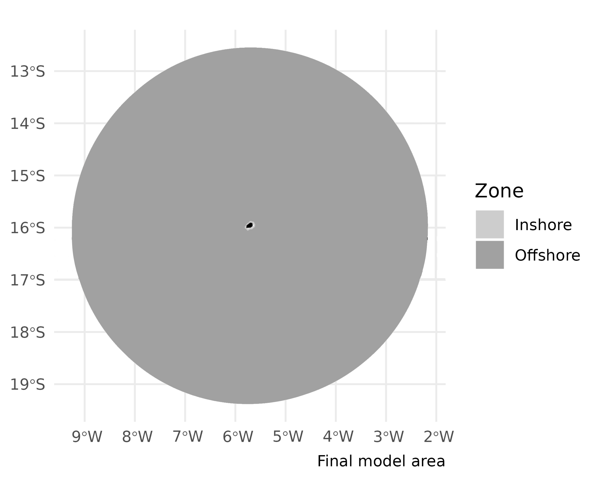

```{r setup, include=FALSE}

Sys.setlocale("LC_ALL", "pt_BR.UTF-8")
knitr::opts_chunk$set(echo = FALSE, warning = FALSE, message = FALSE, fig.align = "left")

library(tidyverse)
library(sf)
library(gt)

source("@_Region file.R")

table_nums <- captioner::captioner(prefix = "Table ")

table.ref <- function(x) stringr::str_extract(table_nums(x), "[^:]*")

model <- StrathE2E2::e2e_read("Saint_Helena_MA_MPA", "2010-2019-CNRM-ssp126", models.path = "Files")

Area <- read.csv(str_glue("Files/Saint_Helena_MA_MPA/2010-2019-CNRM-ssp126/Param/event_timing_SAINT_HELENA_MA_2010-2019-CNRM-ssp126.csv")) %>% 
  filter(str_detect(Description, "km²")) %>% 
  .$Value

Area
```

# Introduction {.unnumbered}

This document describes the configuration of StrathE2E for Saint Helena Island and its parameterisation to enable stationary state fitting for both the baseline period (2010-2019) and future projections (2020-2069). These represent contrasting periods of environmental conditions.

Volumetric and seabed habitat data define the physical configuration of the system.
We regard these as being fixed in time.
Similarly, we regard the physiological parameters of the ecology model as being fixed in time.
Some of these are set from external data.
The remainder are fitted, as detailed here.
Changes in the model performance between the different time periods therefore stem from the hydrodynamic, hydro-chemical and fishery driving data.
These are detailed in the ecological drivers and fishing fleet sections.

In the StrathE2E model all marine lifeforms are explicitly or implicitly accounted for, but aggregated into coarse groups or 'guilds' defined mainly by feeding characteristics and diet preferences (Figure \@ref(fig:guilds).
All state variables, except macrophytes, are expressed solely in terms of nitrogen mass.
For more information about the StrathE2E model check the [documentations](http://www.marineresourcemodelling.maths.strath.ac.uk/strathe2e/) available.

```{r guilds, echo=FALSE, fig.cap="Ecological guilds of the StrathE2E model (Heath, 2021).", out.width = '100%'}

```

> Department of Mathematics and Statistics, University of Strathclyde, Glasgow, UK, E-mail: [m.heath\@strath.ac.uk](mailto:m.heath@strath.ac.uk){.email}
>
> Oceanographic Institute, University of Sao Paulo, Brazil, E-mail: [juliapetroski\@usp.br](mailto:juliapetroski@usp.br){.email}
>
> The code written to support this parameterisation is available on [github](https://github.com/Jack-H-Laverick/MA.SaintHelena).

<br>

# Model Domain {.unnumbered}

```{r island, echo=FALSE, out.width = '100%'}

```

Saint Helena (15.96°S, 5.70°W) is a remote volcanic island with its top rising approximately 800 meters above sea level [@carleton10]. It is located off the South Mid-Atlantic Ridge and forms part of the British Overseas Territory of Saint Helena, Ascension, and Tristan da Cunha. The island has a 200-nautical-mile Exclusive Economic Zone (EEZ), which is governed and utilized by the St Helena Government and the local population. In 2016, Saint Helena's entire EEZ was designated as a IUCN Category VI sustainable-use Marine Protected Area (MPA) by the Environmental Protection Ordinance [@stg16].

Saint Helena does not have reef-building corals. Instead, its narrow inshore habitats consist of boulder and bedrock reefs, as well as sandy beaches [@stg23]. The majority of the EEZ comprises pelagic habitats and deep ocean waters.

The model splits the domain into three zones, inshore/shallow, offshore/shallow, and offshore/deep (Figure \@ref(fig:overhang)).
The inshore/shallow zone covers waters shallower than 60 m or within 4.5 km from shore.
The offshore zone encompasses the remaining area of the model domain and is further divided into a shallow and a deep layer.
The shallow layer represents water from the surface to 60 m depth, and shares a boundary with the inshore shallow zone.
The offshore/deep zone covers the same area as the offshore/shallow zone, but represents water between 60 m and 600 m deep.
There is a second internal boundary between the two offshore zones.

```{r overhang, echo=FALSE, fig.cap="The spatial structure of StrathE2E; Ocean volumes and seafloor habitats. StrathE2E is built around a simplified spatial structure which represents shelf seas. These spatial units are connected to each other and to boundaries as shown to the right. The volumes connected to each spatial component are highlighted in blue.", out.width = '100%'}
knitr::include_graphics("img/overhang.png")
```

The seafloor within the StrathE2E model can be classified into eight habitat types.
These include three sediment classes: fine (muddy, 1), medium (sandy, 2), and coarse (gravel, 3), with the fourth class (rock, 0) indicating the absence of soft sediment.
These sediment classes are defined in both the inshore/shallow and offshore/deep zones.

As of V.4, StrathE2E2 can represent an offshore "overhang" where open ocean does not contact the seafloor (Figure \@ref(fig:overhang)).
The perimeter of the offshore zone in the model domain is the edge of the MPA, with a "false bottom" (overhang) that exchanges with the deep sea.
By using the MPA to define the model domain, we accurately represent the protected area status of Saint Helena Island, which also corresponds to its EEZ.
The sea surface area of the model domain was estimated to be 450,906.82 km².

```{r domain, echo=FALSE, fig.cap="Map of the model domain. StrathE2E defines seabed sediment habitats as inshore (light gray) or offshore/overhang (dark gray). Within each zone, three sediment classes can be represented -- fine (muddy, 1), medium (sandy, 2) and coarse (gravel, 3). A fourth class (rock, 0) represents an absence of soft sediment. In this model implementation the inshore and offshore were divided into 25% sand, 25% rock and 50% gravel sediment, where most of the model domain (>99.7%) is overhang with a false seabed. The sea surface area of the model was estimated to be 450,906.82 km².", out.width = '100%'}

```

# Fixed Physical {.unnumbered}

## Background {.unnumbered}

#### Water column inshore/shallow and offshore/deep zone area proportions and layer thicknesses; seabed habitat area proportions and sediment properties: {.unnumbered}

The depth boundary between deep and shallow layers was determined using vertical diffusivity values from NEMO-MEDUSA [@yool13] and mixed layer depth from Globcolour [@globcolour].
The shallow-deep layer division was set at 60 m, with a bottom depth of 600 m for the deep layer. The offshore zone then extends to the edge of the EEZ, but with a “false bottom” that exchanges with the deep sea (without seafloor). 
In the coastal zone, the polygon is defined for areas shallower than 60 m or within 4.5 km of the coast. 
The sediment classes were roughly designated as sand, gravel, and rock based on the seabed habitats from the habitat map denoting seabed type in the Marine Management Plan [@stg23].

```{r sediment, echo=FALSE, out.width = '100%'}
knitr::include_graphics("img/island2.png")
```

\newpage
#### Parameters for relationship between median grain size, sediment porosity and permeability. Permeability is used as the basis for estimating hydraulic conductivity which is a parameter in the representation of sediment processes in the model: {.unnumbered}

Porosity (proportion by volume of interstitial water) and permeability of each sediment habitat were derived from median grain sizes using empirically-based relationships.

$$log_{10}(porosity) = p_3 + p_4\left(\frac{1}{1+e^{(\frac{-log_{10}(D_{50})-p_1}{p_2})}}\right)$$ D~50~ = median grain size (mm); parameters p~1~ = -1.227, p~2~ = -0.270, p~3~ = -0.436, p~4~ = 0.366 [@heath21]

$$permeability = 10^{p_5}∙D_{50}^{*p_6}$$

where D~50~\* = 0.11 ≤ D~50~ ≤ 0.50 p~5~ = -9.213, p~6~ = 4.615 [@heath15].

These relationships are coded into the StrathE2E2 R-package with the parameters in the csv setup file for the North Sea model.
The parameters are probably a reasonable starting point for any future model of a new region.
Derivation of the parameters is described in the following text sub-sections.

#### Parameters for in-built relationship between sediment mud content, and slowly degrading (refractory) organic nitrogen content of seabed sediments (see description in this document): {.unnumbered}

Values for each sediment type derived from parameterised relationships between total organic nitrogen content of sediments (TON%, percent by weight), mud content (mud%, percent by weight) and median grain size (D~50~, mm).

$$mud\% = 10^{p_7}∙𝐷_{50}^{𝑝_8}$$ p~7~ = 0.657, p~8~ = -0.800

$$TON\% = 10^{𝑝_9}∙mud\%^{𝑝_{10}}$$

p~9~ = -1.965, p~10~ = 0.590

Proportion of TON estimated to be refractory = 0.9

These relationships, along with their parameters, are documented in the North Sea implementation of the StrathE2E2 package [@heath21].
While there may be regional variations, these relationships serve as a reasonable starting point for the Saint Helena implementation.
The StrathE2E2 R-package encodes these relationships, with the parameters specified in the CSV setup file.
Derivation of the parameters is described in the following sub-sections.

## Model area proportions {.unnumbered}

```{r area_proportions_cap}

tab_area_proportions_cap <- table_nums(name = "tab_area_proportions", 
    caption = stringr::str_glue("Area-proportions of the inshore and offshore zones and the thicknesses of the                                        water column layers. The sea surface area of the model domain is an estimated 450,906.82 km²."))
```

`r table_nums("tab_area_proportions")`

```{r area_proportions}

data_frame(Property = c("Sea-surface area proportion",
                        "Upper layer thickness (m)",
                        "Lower layer thickness (m)"),
           `Inshore/shallow` = c(model[["data"]][["physical.parameters"]][["x_shallowprop"]], 
                                 model[["data"]][["physical.parameters"]][["si_depth"]], 
                                 NA),
           `Offshore/deep` = c(1 - model[["data"]][["physical.parameters"]][["x_shallowprop"]], 
                               model[["data"]][["physical.parameters"]][["so_depth"]], 
                               model[["data"]][["physical.parameters"]][["d_depth"]])) %>% 
  gt() %>% 
  fmt_number(columns = c("Offshore/deep", "Inshore/shallow"), decimals = 4, use_seps = FALSE)


```

```{r habitat_proportions_cap}

tab_habitat_proportions_cap <- table_nums(name = "tab_habitat_proportions", 
    caption = stringr::str_glue("Area proportions and other characteristics of the seabed habitat classes defined in the model by depth, rock or sediment type. The sea surface area of the model domain is an estimated 450,906.82 km². Grain size is the median in mm, Permeability in units of m^2^, nitrogen content in %dw."))
```

`r table_nums("tab_habitat_proportions")`

```{r habitat_proportions}

physical <- read.csv(str_glue("Files/Saint_Helena_MA_MPA/2010-2019-CNRM-ssp126/Param/physical_parameters_SAINT_HELENA_MA.csv"))
  
proportions <- which(str_detect(physical$Description, "Area_proportion"))
porosity <- which(str_detect(physical$Description, "Defined_porosity"))
permeability <- which(str_detect(physical$Description, "Defined_permeability"))
nitrogen <- which(str_detect(physical$Description, "Defined_total_N"))
grain <- which(str_detect(physical$Description, "grain_size"))

depth_vector <- c(rep(c("Shallow"), each = 4), rep(c("Deep"), each = 5))
zone_vector <- c(rep(c("Inshore"), each = 4), rep(c("Offshore"), each = 5))

data_frame(Habitat = c("S0", "S1", "S2", "S3", "D0", "D1", "D2", "D3", "OV"),
           Depth = depth_vector,
           Zone = zone_vector,
           Sediment = rep(c("None (Rock)", "Fine", "Medium", "Coarse", "None (Rock)", "Fine", "Medium", "Coarse", "Overhang")),
           `Area Proportion` = physical$Value[proportions],
           `Grain size` = c(0, physical$Value[grain[1:3]], 0, physical$Value[grain[4:6]], NA),
           Porosity = c(NA, physical$Value[porosity[1:3]], NA, physical$Value[porosity[4:6]], NA),
           Permeability = c(NA, physical$Value[permeability[1:3]], NA, physical$Value[permeability[4:6]], NA),
           `Nitrogen content` = c(NA, physical$Value[nitrogen[1:3]], NA, physical$Value[nitrogen[4:6]], NA)) %>% 
  group_by(Zone, Depth) %>% 
  gt() %>% 
  fmt_number(columns = c("Area Proportion", "Grain size", "Porosity", "Permeability", "Nitrogen content"), 
                         decimals = 4, use_seps = FALSE) %>% 
  cols_align(align = 'center',
             columns = c(`Area Proportion`, `Grain size`, Porosity, Permeability, `Nitrogen content`)) %>% 
  tab_options(row_group.background.color = "whitesmoke")


```

## Daily disturbance rates {.unnumbered}

[based on Dougie notes from Silvia, need some review]

To estimate the natural disturbance rate, we applied a rudimentary linear model, as depth-averaged current speeds (including tidal influence) and wave data were unavailable at the local level. We compiled proportional disturbance rates from other regional StrathE2E implementations for mud, sand, and gravel sediments in inshore and offshore regions. Since disturbance is a proportion expected to decrease with depth, we plotted log-transformed disturbance against depth. While no clear pattern emerged, we identified an extreme outlier with unusually low disturbance at a shallow depth. As unaccounted factors likely influenced this outlier, we excluded it from the dataset. We then attempted to fit a linear model of the form log(disturbance) ∼ depth + inshore/offshore + sediment type. However, only the intercept and inshore/offshore variable were statistically significant. To refine the model, we applied stepwise AIC-based selection. This process suggested excluding sediment type, resulting in the final model log(disturbance) ∼ depth + inshore/offshore. All terms in the final model were statistically significant. Transforming the results back to disturbance (rather than log disturbance) and plotting them allowed us to approximate the disturbance vs. depth relationship for both inshore and offshore zones.

## Sediment porosity {.unnumbered}

Log-transformed porosity has been shown to have a sigmoidal relationship with log~10~(median grain size) (D~50~, mm) [@wilson18]:

$$log_{10}(porosity) = p_3 + p_4\left(\frac{1}{1+e^{(\frac{-log_{10}(D_{50})-p_1}{p_2})}}\right)$$
We use this relationship to calculate porosity for sea bed sediments in the Saint Helena (`r table.ref("tab_habitat_proportions")`), using an alternative parameterisation to Wilson [@pace21].
This alternative set of parameters extends the relationship to fine, muddy sediments (`r table.ref("tab_porosity")`).

```{r porosity_cap}

tab_porosity_cap <- table_nums(name = "tab_porosity", 
    caption = "The four parameters for the function relating sediment porosity to median grain size. From Pace et al. (2021)")
```

`r table_nums("tab_porosity")`

```{r tab_porosity}

d50_to_pore <- which(str_detect(physical$Description, "porosity_and_grainsize"))

data_frame(Parameter = paste0("P", 1:4),
           `Fitted value` = physical$Value[d50_to_pore]) %>%
  pivot_wider(names_from = Parameter, values_from = `Fitted value`) %>% 
  gt()

```

## Hydraulic conductivity {.unnumbered}

Hydraulic conductivity (H, m.s^-1^) represents the ease with which fluids flow through the particle grain matrix.
The related term 'permeability' (m^-2^) is a measure of the connectedness of the fluid filled void spaces between the particle grains.
Permeability is a function only of the sediment matrix, whilst conductivity is a function of both the sediment and the permeating fluid, in particular the fluid viscosity and density.
Hydraulic conductivity is related to permeability by:

$$H = Permeability∙fluid\;density∙\frac{𝑔}{dynamic\;viscosity}$$ where: seawater density = 1027 kg.m^-3^ at salinity 35 and temperature 10°C; seawater dynamic viscosity = 1.48 x 10^-3^ kg.m^-1^.s^-1^ at salinity 35 and temperature 10°C; g = acceleration due to gravity = 9.8 m.s^-1^

Hence, $H = Permeability · 6.8004·10^6$ (m.s^-1^ at salinity 35 and temperature 10°C)

Whole sediment permeability can be related to the proportion of sediment classed as mud (D~50~ \< 62 μm) [@pace21].
In this model implementation, this relationship is utilized for internal calculations.

## Sediment organic nitrogen content {.unnumbered}

The magnitude of the static (refractory) organic nitrogen detritus pool in each sediment type is a required input to the model.
The code includes an option to impute values from empirical relationships between total organic nitrogen (TON) and mud content, and between mud content and median grain size.
This relationship has been documented in the North Sea implementation [@heath21].
For the Saint Helena implementation, the total nitrogen content is internally calculated and based on that relationship.

# Fixed biological {.unnumbered}

## Configuration parameters {.unnumbered}

### Assimilation efficiencies for each living guild in the model. {.unnumbered}

Fixed parameters defining the proportion of ingested mass of food that contributes to new body tissue, after subtracting defecation and the metabolic costs of digestion and synthesis [@heath12].

### Biomass loss rates due to temperature-dependent metabolism for each living resource guild. {.unnumbered}

Proportion of biomass lost to ammonia per day due to non-feeding related metabolism at a given reference temperature.
Rates for individual guilds broadly related to typical body mass of representative species.
Temperature dependency following a Q~10~ function.

### Q~10~ values for temperature dependent processes, and the Q~10~ reference temperature. {.unnumbered}

Separate Q10 values for autotrophic uptake of nutrient, heterotrophic feeding, and heterotrophic metabolism based on literature data.

### Light intensity required to saturate autotrophic nutrient uptake. {.unnumbered}

Light saturation intensity for nutrient uptake cannot be treated as a fitted value since it is confounded with other uptake parameters.
Value estimated from survey of laboratory experiments.

### Annual weight specific fecundities of planktivorous and demersal fish guilds and the two benthos guilds in the model (suspension/deposit feeders and carnivore/scavenge feeders). {.unnumbered}

Guild-level values derived by surveying the literature.

### Harvestable biomass density threshold for each resource guild. {.unnumbered}

The living resource guilds in the model represent a mixture of harvestable and non-harvestable species, especially the invertebrate guilds.
The density threshold parameter sets a limit for the guild biomass below which the harvestable species are assumed to be exhausted.
Values set from analysis of trawl, plankton and benthos survey species biomass compositions.

### Minimum inedible biomass of carnivorous zooplankton. {.unnumbered}

The carnivorous zooplankton guild is a key component of the food web, predated on by all the fish and top-predators.
However it represents an extremely diverse range of fauna many of which are not edible in significant quantities by the guild predators, e.g. scyphomedusae.
A minimum edible threshold is set to ensure that the guild as a whole cannot be extirpated by predation.
The value is a rough estimate of scyphomedusae biomass.

## Event timing parameters (not fitted) {.unnumbered}

### Spawning and recruitment start and end dates for fish and benthos {.unnumbered}

We gathered the spawning and recruitment periods for each guild based on literature regarding the main species, described below and in (`r table.ref("tab_event")`). In the model the annual weight-specific fecundity is assumed to be shed uniformly between the start and end dates of spawning. The annual cohort of larvae/juveniles of each fish and benthos guild is assumed to recruit to the settled stage at a uniform daily rate between the start and end dates.

```{r butterfly, echo=FALSE, out.width = '100%'}

```

#### Planktivorous {.unnumbered}

We found no specific data on the reproductive period of planktivorous species on Saint Helena, except for the report that chub mackerel (*Scomber japonicus*) spawns there in March [@edwards90].  

Therefore, we inferred a spawning period during the austral spring and summer and recruitment in autumn and winter, also based on data from small pelagics at the Saint Peter and Saint Paul Rocks (SPSP, see more details in <https://www.marineresourcemodelling.maths.strath.ac.uk/strathe2e/articles/Implementations.html>). This was primarily derived from flyingfish (*Cypselurus cyanopterus*). In SPSP, spawning occurs from December to March [@lessa99; @pinheiro11], with recruitment occurring from April to June [@lessa04]. 

Based on this, the planktivorous guild’s spawning period was set from December 1 to March 31st, and recruitment from April 1st to June 30th.

#### Demersal {.unnumbered}

The reproductive period for the demersal guild was determined based on the spawning patterns of the rock hind grouper (*Epinephelus adscensionis*), a species of ecological and fisheries importance in Saint Helena Island. 

Most species within the grouper subfamily Epinephelinae form spawning aggregations and spawn over extended periods during the winter and spring [@edwards90]. On Saint Helena and its closest neighbor, Ascension Island, the spawning season occurs from June to November, peaking in August, coinciding with the austral winter [@edwards90; @AIG16; @nolan17; @riley20]. 

Fishers in Saint Helena also report that grouper are difficult to catch in winter months, another indicator of the spawning period [@riley20]. In the absence of specific recruitment data, we set the recruitment period to start 90 days after the end of spawning and continue for 150 days.

#### Carnivorous and scavengers benthos {.unnumbered}

Reports from the Saint Helena Government indicate that lobsters enter early reproductive stages from October 1st to December 31st, with a closed fishing season from January to the end of March due to the advanced reproductive stages of the brown spiny lobster (*Panulirus echinatus*) and stump lobster (*Scyllarides obtusus*) [@sthelena22].

Based on this information, the spawning period for the carnivorous and scavenging benthos guild was set from January 1st to March 31st, with the recruitment period from April 1st to June 30th. In the absence of specific recruitment data, we assumed recruitment to begin 30 days after the spawning period ends, lasting for 120 days.

#### Filter and deposit benthos {.unnumbered}

Research on the reproductive activities of filter and deposit feeding benthos in the Saint Helena is limited.
We adopted the same spawning and recruitment periods used for the FD benthos guild in the South Brazil Bight implementation (see more details at <https://www.marineresourcemodelling.maths.strath.ac.uk/strathe2e/articles/Implementation_The_Brazilian_Shelf.html>) - spawning period from September 1st to February 1st and recruitment from August 1st to January 1st.

```{r event_cap}

tab_event_cap <- table_nums(name = "tab_event", 
    caption = "Biological event timing parameters, constant across the time periods. The data are processed in the model setup to calculate the immigration flux parameters needed in the ecology model. Spawning and recruitment durations were established assuming a month with 30 days.")
```

`r table_nums("tab_event")`

```{r tab_event_timing, fig.cap = tab_event_cap}

data_frame(Parameter = model[["data"]][["biological.events"]][["Description"]] %>% 
                        str_replace_all("_", " "),
           Value = model[["data"]][["biological.events"]][["Value"]]) %>% 
  .[1:16,] %>% 
  gt() %>%
  fmt_number(
    decimals = 0,
    use_seps = FALSE)

```

### Extra-domain stock biomass of migratory, and the proportion invading the domain each year. Start and end dates for the annual invasion, and start and end dates for the emigration. (see description below). {.unnumbered}

The migratory fishes in the region are part of a broader Atlantic stock and perform transatlantic movements, utilizing multiple spawning grounds. Key migratory species making seasonal transits through Saint Helena waters include skipjack tuna (*Katsuwonus pelamis*), bigeye tuna (*Thunnus obesus*), and yellowfin tuna (*Thunnus albacares*), along with other tuna-like species and sharks. The data on the biomass of these migratory fish stocks, the proportion entering the Saint Helena EEZ, and the timing of their migrations is detailed below.

We assumed that there is no feedback between fishing and environmental conditions and the biomass and migration patterns. In this version of StrathE2E the timing of immigration and emigration, and the mass influx across the ocean boundary during the annual immigration phase are treated as period-specific external driving data.

The model setup code calculates the parameters which are needed in the ecology model. These are the only fixed (i.e. non-fitted) ecology model parameters which are period-specific.

```{r tuna, echo=FALSE, out.width='100%'}
knitr::include_graphics("img/tunas.png")
```

Saint Helena likely serves as a feeding ground for sub-adult fish, which migrate to spawning grounds upon reaching maturity [@wright20].
Bigeye tuna (*Thunnus obesus*) and yellowfin tuna (*Thunnus albacares*) primarily spawn in tropical waters, such as the Gulf of Guinea and the Gulf of Mexico, during the summer [@carleton10; @fao11].
Recent tagging studies on yellowfin tuna show that they remain in Saint Helena waters for extended periods, ranging from six months to a year, during which they feed and grow [@wright20].
They are typically recruited into the fishery between February and April each year and leave the population upon reaching a length of 120 cm [@wright20].
Yellowfin tuna reach an average size of 96 to 120 cm at Cardno Seamount in May/June, suggesting migration out of the EEZ at this size [@wright20; @wright21].

We utilized outputs from the SEAPODYM model to characterize the movement dynamics of tunas in the Atlantic Ocean, as part of research conducted within the Mission Atlantic project [@merillet24]. These outputs were based on the same four climate projections derived from NEMO-ERSEM physical outputs used in the StrathE2E driving data (see pages 26-29). The projections are driven by two SSPs (SSP3-7.0 and SSP1-2.6) and two CMIP6 models (CNRM-CM6-1-HR and GFDL-ESM4). Two species, skipjack tuna (*Katsuwonus pelamis*) and albacore tuna (*Thunnus alalunga*), were modeled using SEAPODYM-MASS, an age-structured dynamic population model that accounts for prey availability [@seapodym1; @seapodym2]. Historical data were provided from 1990 to 2014, along with projections from 2015 to 2070, on a monthly basis and averaged across the Saint Helena model domain. Data included local biomass estimates for each SSP variant, forcing model variant, and total stock biomass in the Atlantic.

To establish the baseline period from 2010-2019, historical data from 2010–2014 were combined with projections from 2015–2019. The remaining time series were divided into decadal intervals from 2020–2029 to 2060–2069 for each of the four climate projections. 

To identify the start and end days for annual immigration and emigration periods, we interpolated data to obtain daily values averaged by decade for each projection. To synchronize with the StrathE2E annual cycle, each month was standardized to 30 days. 
Seasonal cycles for each decade and projections were extracted using the decompose function in R, excluding trends and random components - for more information check the [function documentation](https://www.rdocumentation.org/packages/stats/versions/3.6.2/topics/decompose/). 
Immigration and emigration periods were defined as the days when biomass increased from the 20th to 80th percentile and decreased from the 80th to 20th percentile, respectively.

```{r migration, echo=FALSE, fig.cap = "Seasonal component of migratory fish biomass derived from SEAPODYM model outputs. Points A to D indicate the start and end dates of immigration and emigration for each decade (2010–2019 to 2060–2069), under two climate scenarios (SSP1-2.6 and SSP3-7.0) and two forcing models (CNRM and GFDL).", out.width='400%'}

```

Discussions with the model’s authors suggested that parameterization favored skipjack biomass in tropical and equatorial regions. To address this, we scaled the local tuna biomass using a factor derived from regional stock assessment. The scaling equation below was applied in all Mission Atlantic case studies to adjusted SEAPODYM outputs to better reflect local stock assessments. Where no local assessments were available, as in the Saint Helena domain, α defaulted to 1. Additionally, another scaling factor (\(\lambda\)) was applied in cases where skipjack and albacore alone do not represent the entire migratory guild, as in the Saint Helena Island domain.

The scaled biomass was calculated as:

\[\alpha = \frac{\ln\left(\frac{x(t)}{X(t)}\right)}{\ln(P)}, \quad \lambda = \frac{Y(t)}{X(t)}\]

\[scaled \ biomass(t) = [P]^\alpha \times X(t) \times \lambda\]

Where:

-\(P\) is the proportion of the Atlantic stock entering the model domain annually, from SEAPODYM;\
-\(\alpha\) is the scaling factor to adjust the local biomass relative to known stock assessments;\
-\(X(t)\) is the Atlantic stock from SEAPODYM;\
-\(Y(t)\) is the Atlantic biomass from stock assessments;  
-\(x(t)\) is the local biomass from stock assessments;  
-\(\lambda\) is the scaling factor to the others Atlantic stocks that may enter the model domain

In the case of Saint Helena, \(\lambda\) was derived from stock assessments from the 2010s. Part of the management of Atlantic migratory fish stocks falls under the International Commission for the Conservation of Atlantic Tunas (ICCAT), which relies on a consensus-based decision-making process among its member nations. To estimate the ‘global’ stock biomass of migratory fish assumed to enter the model domain, we compiled data for 18 species, including key species such as the aforementioned skipjack, yellowfin, bigeye, and albacore tuna, along with wahoo (*Acanthocybium solandri*), frigate tuna (*Auxis thazard*), Galapagos shark (*Carcharhinus galapagensis*), common dolphinfish (*Coryphaena hippurus*), Atlantic sailfish (*Istiophorus albicans*), shortfin mako (*Isurus oxyrinchus*), white marlin (*Kajikia albida*), blue marlin (*Makaira nigricans*), blue shark (*Prionace glauca*), Atlantic bonito (*Sarda sarda*), smooth hammerhead (*Sphyrna zygaena*), southern bluefin tuna (*Thunnus maccoyii*), Atlantic bluefin tuna (*Thunnus thynnus*), and swordfish (*Xiphias gladius*).

Biomass data were sourced from Sea Around Us (SAU), which utilizes ICCAT data and the CMSY method - [@sau](https://www.seaaroundus.org/cmsy-method).
SAU estimates, available for 2010–2018, were averaged for this analysis. The combined biomass of the 18 key stocks in the Atlantic, which may enter the Saint Helena EEZ, totaled 5,503,844.45 tons.

The scaling factor  \(\lambda\) was calculated by dividing the global migratory biomass by SEAPODYM's skipjack and albacore stock estimates. This factor was then applied to SEAPODYM’s local skipjack and albacore biomass estimates to calculate total migratory biomass averaged by decade, model, and SSP. The annual proportion of Atlantic migratory biomass entering the Saint Helena domain was determined by dividing the scaled local biomass by the scaled Atlantic migratory biomass.

An increase in the proportion of migratory fish migrating to Saint Helena suggests that the island will become more suitable for tunas by the 2060s under these climate projections, except in the SSP1-GFDL model variant (`r table.ref("tab_tunas")`). This trend was integrated into StrathE2E to investigate its potential impacts on the entire food web and fisheries. 

```{r bio-migratory, echo=FALSE, fig.align='center', fig.cap="Scaled annual mean migratory fish biomass from SEAPODYM model outputs for each decade (2010–2019 to 2060–2069), under two climate scenarios (SSP1-2.6 and SSP3-7.0) and two forcing models (CNRM and GFDL).", out.width = '100%'}

```

To assess the proportion of peak biomass that remained within the model domain even in the emigration period we extracted the maximum and minimum values from the seasonal cycle. Compared to the literature available, yellowfin tuna exhibit high fidelity to the area and remain in St. Helena waters for extended periods due to elevated productivity levels associated with the island and seamounts [@wright19; @wright21]. 

The full set of parameters used for migratory fish event timing is detailed in lines 17–26 of the event_timing_SAINT_HELENA_*.csv files for each decade under the four climate projections.

```{r tunas_cap}

tab_tunas_cap <- table_nums(name = "tab_tunas", 
    caption = "Time-variant biological event timing parameters related to migratory fish for the baseline period (2010-2019) and last decade of analysis (2060-2069) across the four climate projections, used as parameters data.")
```

`r table_nums("tab_tunas")`

```{r tunas_baseline, fig.cap = tab_tunas_cap}
library(gt)
migratory_fish_data <- data.frame(
  Parameter = c(
    "Ocean biomass",
    "Propn of ocean popn entering per year",
    "Immigration start day",
    "Immigration end day",
    "Propn of peak popn which remains",
    "Emigration start day",
    "Emigration end day"),
  `2010-2019_SSP1-CNRM` = c("5214177", "0.01273", "203", "346", "0.9352", "59", "132"),
  `2010-2019_SSP3-CNRM` = c("5278278", "0.01299", "207", "352", "0.9197", "65", "136"),
  `2010-2019_SSP1-GFDL` = c("5767905", "0.01319", "260", "343", "0.8931", "56", "189"),
  `2010-2019_SSP3-GFDL` = c("5808957", "0.01334", "239", "332", "0.8943", "45", "143"),
  `2060-2069_SSP1-CNRM` = c("6503421", "0.01206", "71", "162", "0.8697", "233", "358"),
  `2060-2069_SSP3-CNRM` = c("6745468", "0.01171", "48", "149", "0.8988", "220", "335"),
  `2060-2069_SSP1-GFDL` = c("6407583", "0.01146", "71", "187", "0.8196", "258", "358"),
  `2060-2069_SSP3-GFDL` = c("6766477", "0.01158", "66", "170", "0.8540", "241", "353"),
  check.names = FALSE)

migratory_fish_data %>%
  gt(rowname_col = "Parameter") %>%
  tab_spanner(label = "2010-2019",
    columns = vars(`2010-2019_SSP1-CNRM`, `2010-2019_SSP3-CNRM`,
                   `2010-2019_SSP1-GFDL`, `2010-2019_SSP3-GFDL`)) %>%
  tab_spanner(label = "2060-2069",
    columns = vars(`2060-2069_SSP1-CNRM`, `2060-2069_SSP3-CNRM`,
                   `2060-2069_SSP1-GFDL`, `2060-2069_SSP3-GFDL`)) %>%
  cols_label(
    `2010-2019_SSP1-CNRM` = "SSP1-CNRM",
    `2010-2019_SSP3-CNRM` = "SSP3-CNRM",
    `2010-2019_SSP1-GFDL` = "SSP1-GFDL",
    `2010-2019_SSP3-GFDL` = "SSP3-GFDL",
    `2060-2069_SSP1-CNRM` = "SSP1-CNRM",
    `2060-2069_SSP3-CNRM` = "SSP3-CNRM",
    `2060-2069_SSP1-GFDL` = "SSP1-GFDL",
    `2060-2069_SSP3-GFDL` = "SSP3-GFDL") %>%
  cols_align(align = "center", columns = vars(
    `2010-2019_SSP1-CNRM`, `2010-2019_SSP3-CNRM`,
    `2010-2019_SSP1-GFDL`, `2010-2019_SSP3-GFDL`,
    `2060-2069_SSP1-CNRM`, `2060-2069_SSP3-CNRM`,
    `2060-2069_SSP1-GFDL`, `2060-2069_SSP3-GFDL`)) %>%
  cols_width(Parameter ~ px(300)) %>%
  tab_options(table.font.size = 11.5,
    table.align = "center")
```

```{r migrant_cap}

tab_migrant_cap <- table_nums(name = "tab_migrant", 
    caption = "Fixed biological event timing parameters related to migratory fish, constant across the time periods and climate projections")
```

`r table_nums("tab_migrant")`

```{r tab_migrant_b, fig.cap = tab_migrant_cap}

data_frame(Parameter = model[["data"]][["biological.events"]][["Description"]] %>% 
                        str_replace_all("_", " "),
           Value = model[["data"]][["biological.events"]][["Value"]]) %>% 
  slice(c(17, 19, 20)) %>%  
  gt() %>%
  fmt_number(
    decimals = 3,
    use_seps = FALSE)
```

# Ecological drivers {.unnumbered}

[Compiled from Norwegian Sea Rmd, need some review]

Monthly resolution time-varying physical and chemical driving parameters for the model were derived from a variety of sources:

- Temperature, vertical mixing coefficients, volume fluxes, and boundary nutrient, detritus and phytoplankton concentrations from outputs of an ensemble of NEMO-ERSEM coupled hydro-geochemical model runs with a 2015 historical/future split CITE YURI XXX.
- Surface shortwave radiation from CMIP6 used to force the NEMO-ERSEM coupled hydro-geochemical runs mentioned above.
- Freshwater volume outflows from CMIP6 used to force the NEMO-ERSEM coupled hydro-geochemical runs mentioned above.
- River nitrate and ammonia concentrations taken from the IMAGE model to force the NEMO-ERSEM coupled hydro-geochemical runs mentioned above.
- Atmospheric deposition of nitrate and ammonia from ISIMIP3a ([Inter-Sectoral Impact Model Intercomparison Project](https://data.isimip.org/10.48364/ISIMIP.759077.2); @yang22) with SSP projects from ISIMIP3b used to force the NEMO-ERSEM coupled hydro-geochemical runs mentioned above.
- Remote sensing data products on Suspended Particulate Matter (Globcolour L3b; <ftp://ftp.hermes.acri.fr/GLOB/merged/month/>).
- Wave height, period, and direction from the ERA-5 reanalysis monthly means accessed through [CDS](https://cds.climate.copernicus.eu/cdsapp#!/dataset/10.24381/cds.f17050d7?tab=overview) for 1980-2021 [@Hersbach19].

Details of how these data were processed are given below, supported by the [nemomedusR](https://jack-h-laverick.github.io/nemoRsem/) and [MiMeMo.tools](https://jack-h-laverick.github.io/MiMeMo.tools/) packages.

### NEMO-ERSEM ensemble: {.unnumbered}

Four different NEMO-ERSEM runs were used to parameterise different versions of the Saint Helena Island implementation of StrathE2E.
These four runs are a 2x2 factorial cross of two future projected scenarios (SSP1-2.6 and SSP3-7.0) with a historical hindcast from 2015, and forcing by two atmospheric CMIP6 models (CNRM-CM6-1-HR and GFDL-ESM4)
In the following sections model output was processed for a 2010-2019 baseline period, and then decadal projections from 2020-2029 until 2060-2069.

### Vertical mixing coefficients between the model layers: {.unnumbered}

Vertical diffusivity from the NEMO-ERSEM coupled hydro-geochemical model output was interpolated for each grid cell at the `r SDepth`m boundary depth between the shallow and deep layers of the offshore zone, and the `r DDepth`m boundary at the deep sea overhang.
These values were summarised as monthly averages into period-specific climatological annual cycles of data for decadal periods for all combinations of SSPs and forcings.

### Monthly averaged temperatures for each water column layer: {.unnumbered}

Derived by monthly averaging values at grid points within the inshore and vertical layers of the offshore zones from the NEMO-ERSEM coupled hydro-geochemical model output, weighted by grid point volumes.
Values were summarised into period-specific climatological annual cycles of data.

### Monthly averaged suspended particulate matter (SPM) concentrations (mg.m^-3^) in the shallow zone and the deep zone upper layer: {.unnumbered}

Monthly averaged values of inorganic suspended particulate matter in sea water are available from the Globcolour project, starting from September 1997.
These data are derived from satellite observations using the algorithm of Gohin [@gohin11].
Data were downloaded from the ftp server (<ftp://ftp.hermes.acri.fr/GLOB/merged/month/>).
We summarised these values as zonal statistics for the model domain to acquire a climatological annual cycle of data for the 2010-2019 simulation period only.

### Monthly average light attenuation coefficients for the inshore and offshore surface layers: {.unnumbered}

Light attenuation in open water was parameterised from a linear relationship between the light attenuation coefficient and suspended particulate matter concentration (SPM) [@devlin08].

### Monthly averaged daily integrated irradiance at the sea surface (E.m^-2^.d^-1^): {.unnumbered}

Derived from HadGEM2-ES model output [@jones11] which forces the NEMO-ERSEM model run used throughout our implementation.
Monthly mean values were summarised into climatological annual cycles of data for decadal periods and NEMO-ERSEM ensembles.

### Monthly averaged daily atmospheric deposition rates of oxidised and reduced nitrogen onto the sea surface in the shallow and deep zones (mMN.m^-2^.d^-1^): {.unnumbered}

Sourced from the "histsoc" files for a 1901 - 2021 hindcast as monthly averages [@yang22], available from [CDS](https://cds.climate.copernicus.eu/cdsapp#!/dataset/10.24381/cds.f17050d7?tab=overview).
Monthly values were summarised into climatological annual cycles of monthly oxidised and reduced nitrogen deposition rates extracted for 2010-2019.
ISIMIPb Projections for SSP126 and SSP370 were processed in the same way for decadal periods up to and including the 2060s.

### Monthly averaged, freshwater river inflow rates (expressed as a daily proportion of the receiving layer volume), and concentrations of oxidised and reduced dissolved inorganic nitrogen in the inflowing river waters (mMN.m^-3^): {.unnumbered}

Freshwater inflow derived from HadGEM2-ES model output [@jones11] which forces the NEMO-MEDUSA model run used throughout our implementation.
Monthly values were summaries into a climatological annual cycle of data.

### Volume fluxes into the model domain across open sea boundaries, and from the upper layer of the offshore/deep zone into the inshore/shallow zone, expressed as proportions of the receiving layer volume per day: {.unnumbered}

Monthly averaged daily inflow and outflow volume fluxes derived by integrating daily mean velocities directed perpendicular to transects along the model domain boundary at grid points in each depth layer along transects through outputs from the NEMO-ERSEM coupled hydro-geochemical model output.
Monthly averaged daily inflow volume fluxes then divided by the volume of the receiving layer in the model domain to estimate a daily flushing rate.

### Mean concentrations of nitrate, ammonia, phytoplankton and suspended detritus (mMN.m^-3^), in adjacent ocean waters inflowing to the offshore/deep zone upper layer, adjacent ocean waters inflowing to the offshore/deep zone lower layer, and adjacent shelf waters inflowing to the inshore/shallow zone: {.unnumbered}

NEMO-ERSEM outputs included nitrate, ammonia, phytoplankton and suspended detritus.
We calculated the depth-averaged concentrations for pixels within the shallow and deep layers of StrathE2E.
We then sampled the pixels using the same transects around the model domain as for sampling volume fluxes.
Only transects where water flowed into the model domain were sampled, and the average concentration of inflowing waters for target variables was calculated weighting by the flow rate across a transect and the cross-sectional area represented by a transect (average depth and length).
Concentrations were then averaged into climatological annual cycles.
The flow weighted averaging of concentrations was calculated on the 5-day NEMO-ERSEM timestep, before averaging to a monthly climatology of concentrations.

# Fishing fleet {.unnumbered}

## Background {.unnumbered}

The key configuration data for the fishing fleet model are the definitions of the gears in terms of their power with respect to each of the harvestable resource guilds, discards and bycatch rates, processing-at-sea rates, and seabed abrasion rates. These can be regarded as static parameters for each fleet. 

An additional class of static parameters is the scaling coefficients between effort (activity x power) and the harvest ratio generated on each model resource guild. These parameters have to be derived by fitting. 

Finally, there are parameters which we can consider as driving data since they would be expected to vary with time. These are the activity rates of each gear, and their spatial distributions across the habitat types.

```{r pone-and-line, echo=FALSE, out.width = '100%'}

```

## Static gear-definition parameters in the fishing fleet model {-}

For the Saint Helena Implementation the fishing fleets were defined based on available data from databases and literature, grouping some gears according to operation similarities, target species and potential policy and management scenarios. The commercial species were categorized into the commercial guilds based on ecological properties using sources such as FishBase (@froese24, <https://www.fishbase.se/>).

The fisheries of St. Helena is small-scale, with a maximum of 40 fishermen [@carleton10]. Local management of these fisheries is overseen by the Directorate of Fisheries of the Government of St. Helena, adhering to the regulations established by the Island Government. On the international level, are under the ICCAT.

The main fishing in the Saint Helena EEZ targets tunas and other large pelagic fishes, with five species comprising the major landings: skipjack tuna (*Katsuwonus pelamis*), bigeye tuna (*Thunnus obesus*), yellowfin tuna (*Thunnus albacares*), albacore/longfin tuna (*Thunnus alalunga*), and wahoo (*Acanthocybium solandri*), making the migratory guild predominant in the fisheries data.
Although St. Helena has never taken more than 0.2% of the Atlantic tuna landings [@wright20], fishing activities on the island are significant for the residents' food supply and cultural heritage [@rees16].

Among the demersal fishes, the reef-associated rock hind grouper (*Epinephelus adscensionis*), deep-water bullseye (*Cookeolus japonicus*), glasseye snapper (*Heteropriacanthus cruentatus*), squirrelfish (*Holocentrus adscensionis*), parrotfish (*Bodianus insularis*), and blackbar soldierfish (*Myripristis jacobus*) are also valuable commercially and in recreational fisheries.

Planktivorous species including mackerel (*Scomber colias*), scads (*Decapterus macarellus*, *D. muroadsi*, and *D. punctatus*), and steenbrass (*Selar crumenophthalmus*) are vital as bait supply for offshore fishing activities [@stg23].

Since 2016, only one-by-one fishing methods have been permitted within the St. Helena EEZ as part of the MPA Management Plan, being prohibited purse seine, bottom trawling, gillnets and others considered unsustainable fishing methods [@stg23].

Based on the fleets that operated during the baseline period, we grouped the following fleets in the fishing model: pole and line, handlines and dip-nets (bait), handlines, longlines, and pots and hand gathering (Fig. \@ref(fig:fleets)). Illegal purse-seine and longline fleets were included in the files without specific values to simulate their potential impact in future studies. 

```{r fishing, echo=FALSE, out.width = '100%'}

```

The pole and line fleet, targeting tunas and other migratory fish, dominated the baseline period, accounting for 90% of the landings.
In this method, tunas feeding at the surface are attracted by baited hooks cast from a stationary vessel [@wright20].
Due to its minimal bycatch, it is considered to be relatively low impact.
Trolling, a modification of the pole and line technique, involves towing live bait behind the fishing vessel on rods, and is also regularly used in St. Helena waters to target wahoo [@collins17].
Due to their similarities, we considered only the pole and line fleet, as the available effort data did not differentiate between the two gears.

Live bait is essential for the pole and line fleet, so the fleet targeting bait (small pelagic planktivorous species) was also included.
Bait is caught using inshore line methods or small handheld dip-nets [@carleton10; @collins17].

The longlines fleet targets swordfish and tuna.
Due to high shark bycatch levels, this fleet has been discouraged by the government since the baseline period and was prohibited in 2020 for not being a "one-by-one" fishing method (St. Helena Policy Statement, 2020).
We included this fleet in the model as there are records of longline fishing between 2010-2019.

In addition, there is handline fishing targeting species with low mobility, such as grouper, bullseye, and other nearshore demersal species [@rees16].
This method uses multiple baited hooks and usually occurs when tuna catches are poor or when the local market demands other species [@stg23].

The pots and hand gathering fleet was grouped to represent the methods used for two species of lobster [@stg16].
For potting, bait (such as fish heads) is placed inside the lobster pot, which is left to soak overnight [@stg23].

Details regarding the sources used for landings, discards, bycatch, effort and other fishing data compilation is described below.

```{r fleets, echo=FALSE, fig.cap="Fishing fleets defined for the StrathE2E Saint Helena EEZ model, their operational descriptions, target-species and discards levels.", out.width = '110%'}

```

## Data processing to derive fishing parameters {-}

### Landings {-}

Data from the Environment and Natural Resources Directorate (ENRD) includes annual landings per species.
It is compiled by the Statistics Office of the St. Helena Government from various sources, including the Fisheries Corporation and the Agriculture and Natural Resources Department (<https://www.sainthelena.gov.sh/st-helena/statistics/>).
This dataset contains information on 20 species distributed across migratory, demersal, planktivorous, and CS benthos guilds.
The fleets were allocated to each species based on information from official government reports.
When available, landings were also divided into inshore and seamount categories using the proportions provided in the CR087 report.

We also utilized data from the ICCAT, which records and stores pelagic fishing data [@ICCAT].
We filtered this data using the UK-Saint Helena flag in the T2CE (Task 2 -- Catch and Effort) database.
We verified that the landing data for the period 2010-2019 for pelagic species matched those available in the ENRD database but were divided into two fleets: rod and reel, and longline.
We considered the rod and reel fleet equivalent to the Pole and Line fleet in our model and used this division accordingly.
The landing data were consistent with the official fisheries statistics of St. Helena, and we applied the same fleet divisions as those present in the ICCAT data, except for swordfish (*Xiphias gladius*), which was not present in the official St. Helena database for this period.
For swordfish, we used the landing values from the ICCAT data.

```{r catchfleet, echo=FALSE, fig.align='center', fig.cap="Catches per year and per fleet compiled for the Saint Helena EEZ StrathE2E model.", out.width = '100%'}
knitr::include_graphics("img/catch.png")
```

#### Pole and line {.unnumbered}

The average annual landings between 2010 and 2019 were 329.5 tonnes, with a maximum of 877.88 tonnes in 2011 and a minimum of 99.6 tonnes in 2013.
All landings targeted the migratory fish guild.
Yellowfin tuna contributed nearly 50% of the total landings, followed by skipjack tuna with 26%, and bigeye tuna with 16%.
The remaining catch consisted of wahoo, albacore/longfin tuna, marlins, and sharks.

#### Longlines {.unnumbered}

Longline fishing occurred only between 2011 and 2013, resulting in a total catch of 23.71 tonnes.
Only species from the migratory fish guild were landed, primarily swordfish and bigeye tuna.

#### Handlines {.unnumbered}

A total of 132.28 tonnes were landed between 2010 and 2019, with a minimum of 2.57 tonnes in 2015 and a maximum of 25.13 tonnes in 2010.
The most fished guild was demersal fish, with 81.219 tonnes of grouper and 21.46 tonnes of conger eel.
Other species caught included cavalley, dorado, and yellowtail.

#### Handlines and dip-nets {.unnumbered}

A total of 27.58 tonnes of planktivorous fish were caught, with the only species identified in the database being mackerels.

#### Pots and Hand-Gathering {.unnumbered}

A total of 0.46 tonnes of the lobsters (Carnivorous and scavengers benthos guild) *Panulirus echinatus* and *Scyllarides obtusus* were landed from 2010 to 2019.

### Discards {.unnumbered}

```{r rock-fishing, echo=FALSE, out.width = '100%'}

```

Guild-specific discard rates (the proportion of the catch discarded) were derived by calculating discard ratios and applying these to the landing values described earlier.

We considered that fishery discards in the St Helena fleets are minimal, primarily due to the use of "one-by-one" techniques, which allow fishermen to avoid unwanted species.
According to [@carleton10], the pelagic fleets in Saint Helena occasionally incidentally catch cavally (*Pseudocaranx dentex*), dolphinfish (*Coryphaena spp.*), blue marlin (*Makaira nigricans*), and pelagic sharks.
However, they report that, aside from some sharks, nearly all incidental catches are either sold or retained by fishermen for home consumption.

@gilman17 evaluated discard rates in global tuna, tuna-like, and billfish fisheries by RFMO area and gear type.
In the ICCAT area of the South Atlantic, no discard rate records were found for handline and pole and line tuna fisheries, which are also considered to have low or negligible discard rates by @kelleher05.
Based on this, we considered the discard rates to be zero for both fleets.

Regarding the baitfish fishery, small-scale fisheries for small pelagics are considered to have low or negligible discard rates [@kelleher05], and there are no non-target species in this fleet in St Helena according to @carleton10.
We also assumed there were no discards in the pot and hand-gathering fleets for lobster.

In contrast, longline fishing trials within Saint Helena's EEZ have reported significant bycatch levels, including blue sharks and other shark species, in addition to the target swordfish [@collins17].
The FAO global database [@kelleher05] indicates that smaller longliners, which typically have shorter trips, tend to retain more sharks and other non-target species, resulting in a discard rate of 15% for these vessels.
Based on this, we adopted the discard rate of 15% for longlines for the migratory guild.

### Bycatch {.unnumbered}

We did not find records of bycatch occurrence involving marine mammals or seabirds in the St Helena fleets. Seabirds such as boobies, noddies, and diving petrels do associate with fishing vessels and sometimes take live or cut bait, but no seabird bycatch was observed or reported in any UK Overseas Territories recently [@iccat22]. Rough-tooth dolphins (*Steno bredanensis*) often take bait off hooks and can hinder fishing activities, but they are not adversely affected by fishing operations [@carleton10]. While the occasional seasonal harvesting of dolphins occurred until the 1970s, there is no evidence of any fishery-related cetaceans deaths in recent decades [@carleton10].

However, it is anticipated that some seabird bycatch may occur in the longline fleets. We extrapolated seabird bycatch rates from similar fleets from another island in the South Mid-Atlantic Ridge, Saint Peter and Saint Paul Rocks (see more details in <https://www.marineresourcemodelling.maths.strath.ac.uk/strathe2e/articles/Implementations.html>). We applied a mortality rate of 0.05 birds per day for longline fleets and 0.143 birds per day for handlines [@bugoni08]. These daily bird mortality rates were multiplied by the estimated fishing days for each fleet (see subsection below for fishing effort). To estimate bycatch in terms of biomass, we used the average weight of these species as reported in the literature. The total bycatch from both fleets was estimated at approximately 9 individual birds, equivalent to around 0.047 tonnes per year (`r table.ref("tab_bycatch")`). This data was converted to mMN.m⁻².y⁻¹ using the appropriate conversion factor with molar nitrogen mass (see detailed nitrogen mass sources per unit wet weight at the [North Sea Implementation](https://www.marineresourcemodelling.maths.strath.ac.uk/resources/StrathE2E2/documents/4.0.0/StrathE2E2_North_Sea_model.pdf)).

It is important to note that the methodology developed here is a simplification, designed only to parameterize the Saint Helena EEZ StrathE2E model. The annual bycatch data presented should not be regarded as a comprehensive assessment of bycatch in the region.

```{r byc_cap}

tab_byc_cap <- table_nums(name = "tab_bycatch", 
    caption = stringr::str_glue("Seabird guild bycatch rates per fleet applied in the baseline period for the Saint Helena Island implementation. Average weight from compilation in target data of booby, noddy and petrels. Bycatch individuals per fishing day estimated using @bugoni08 for tropical longlines"))
```

`r table_nums("tab_bycatch")`

```{r bycatch_tab}

bycatch_tab <- data.frame(
  `Fleet` = c("Longlines", "Handlines"),
  `Fishing days` = c("9.12 ± 19.84", "60.5 ± 50.02"),
  `Bycatch (individuals)` = c("0.46 ± 0.99", "8.65 ± 7.15"),
  `Average seabird weight (t)` = c(0.0051, 0.0051),
  `Bycatch (t)` = c("0.0023 ± 0.0051", "0.0443 ± 0.0366"),
  `Bycatch (mMN/m²/year)` = c("1.30E-08 ± 2.83E-08", "2.47E-07 ± 2.04E-07"),
  check.names = FALSE)

tab <- bycatch_tab %>%
  gt() %>%
  tab_options(
    table.font.size = 11.5,
    column_labels.font.weight = "bolder",) %>%
  cols_align(align = "center")
tab

```

### Fishing effort {.unnumbered}

We utilized data from ICCAT, which records and stores pelagic fishing data, filtering for the UK-Saint Helena flag in the T2CE database, Task 2 – Catch and Effort [@ICCAT]. We verified that the landing data for pelagic species from 2010-2019 matched those available in the ENRD. 

We used fishing effort in terms of fishing days for longline and line days (considered equivalent to fishing days) for rod and reel. The "Rod and Reel" gear category in the ICCAT database was renamed to "Pole and Line" to be consistent with the catch data. This resulted in an average of 1885.6 fishing days from 2010-2019 for the Pole and Line fleet targeting tuna and tuna-like species. We assumed 8 hours of fishing per day for conversion to fishing hours. 

For the longline fleet, we obtained an average of 30.67 fishing days from ICCAT records from 2013-2015 for longline targeting swordfish and tunas (`r table.ref("tab_effortll")`). We assumed 12 hours of fishing per day for conversion to fishing hours.

```{r effortll_cap}

tab_effortll_cap <- table_nums(name = "tab_effortll", 
    caption = stringr::str_glue("Pole and line effort compiled for the baseline period implementation of Saint Helena EEZ model from ICCAT data, assuming 8 hours of fishing per day."))
```

`r table_nums("tab_effortll")`

```{r effortll_tab}

effortll_table <- data.frame(
  `Year` = c(2010, 2011, 2012, 2013, 2014, 2015, 2016, 2017, 2018, 2019),
  `Fishing days` = c(2162, 3974, 2498, 1196, 1194, 1222, 1076, 1638, 1710, 2176),
  `Effort (s.m2-1.day-1)` = c("3.84E-07", "7.05E-07", "4.43E-07", "2.12E-07", "2.12E-07", "2.17E-07", "1.91E-07", "2.91E-07", "3.03E-07", "3.86E-07"),
  check.names = FALSE)

effortll_tab <- effortll_table %>%
  gt() %>%
  tab_options(
    table.font.size = 15,
    column_labels.font.weight = "bolder") %>%
  cols_align(align = "center") %>%
  cols_label(`Effort (s.m2-1.day-1)` = html("Effort (s.m<sup>2</sup>.day<sup>-1</sup>)"),)

effortll_tab
```

For the handline fleet, we considered the effort targeting primality the grouper present in the Blue Belt Programme report for the Saint Helena EEZ [@riley20] from 2010 to 2019, obtaining an average of 60.5 fishing days per year.

For the baitfish fleet, there are no official records of effort.
We made a rough estimate based on information from @collins17 that each vessel would normally collect 20-30 kg of baitfish per fishing day.
We used 25 kg per fishing day and the annual mackerel landing value from 2010-2019 (2.76 kg) to estimate approximately 110 fishing days per year.

There were no available indicators of the effort directed at lobster fishing on Saint Helena. Therefore, we used estimates of approximately 10 kg of spiny lobsters per fishing day using traps in another South-Atlantic island [@freire15]. From 2010 to 2019, an average of 46 kg of lobsters were landed per year, roughly suggesting that five fishing days would be necessary annually.

The final unit for input into the model for each fleet was sec.m^-2^.d^-1^ (`r table.ref("tab_effort")`).

```{r effort_cap}

tab_effort_cap <- table_nums(name = "tab_effort", 
    caption = stringr::str_glue("Effort compiled per fleet for the baseline period implementation of Saint Helena EEZ model"))
```

`r table_nums("tab_effort")`

```{r effort_tab}

effort_table <- data.frame(
  Fleets = c("Pole and line", "Longlines", "Handlines", "Handlines and dip-nets (bait)", "Pots and hand gathering"),
  `Effort (s.year-1)` = c("5.43E+07", "3.97E+05", "2.61E+06", "7.92E+05", "2.16E+05"),
  `Effort (s.m2-1.day-1)` = c("3.34E-07", "2.45E-09", "1.61E-08", "4.88E-09", "1.33E-09"),
  check.names = FALSE)

effort_tab <- effort_table %>%
  gt() %>%
  tab_options(
    table.font.size = 15,
    column_labels.font.weight = "bolder") %>%
  cols_align(
    align = "center") %>%
  cols_label(
    Fleets = "Fleets StrathE2E Saint Helena",
    `Effort (s.year-1)` = html("Effort (s.year<sup>-1</sup>)"),
    `Effort (s.m2-1.day-1)` = html("Effort (s.m<sup>2</sup>.day<sup>-1</sup>)"),)

effort_tab
```

### Fleet Distribution per habitat {.unnumbered}

The distribution of each fleet across habitats was assessed by integrating literature data with sediment habitat information. The majority of fleets operate offshore within the overhang zone of the model. 

Exceptions include the artisanal handlines and hand-gathering and pot fishing fleets, which are predominantly concentrated in the inshore zone. Handline fishing for grouper and pot fishing for lobsters are confined to the inshore rock and gravel habitats area and are not present around the Bonaparte and Cardno seamounts [@collins17; @rees16; @riley20]. 

Baitfish (*Decapterus spp.*) are caught with nets at the surface in waters 10 to 20 meters deep [@carleton10], usually near sandy and rocky inshore beaches [@edwards90]. 

We allocated the fishing effort per habitat as outlined in `r table.ref("tab_distribution")`.

```{r tab_distribution_cap}

tab_distribution_cap <- table_nums(name = "tab_distribution", 
    caption = "Spatial distribution of fishing activity across seabed habitat classes, inferred for Saint Helena based on the characteristics of local fishing fleets. The 'deep ocean' habitat refers to the portion of the offshore zone that extends into deep ocean waters, without a seafloor.")
```

`r table_nums("tab_distribution")`

```{r tab_distribution, fig.cap = tab_distribution_cap}

distribution_tab <- data.frame(
  Fleets = c("Pole and line", "Longlines", "Handlines", "Handlines and dip-nets (bait)", "Pots and hand gathering"),
  `Shallow_rock` = c(0, 0, 0.5, 0.25, 0.5),
  `Shallow_sand` = c(0, 0, 0, 0.5, 0),
  `Shallow_gravel` = c(0, 0, 0.5, 0.25, 0.5),
  `Deep_ocean` = c(1, 1, 0, 0, 0),
  check.names = FALSE)

distribution_tab <- distribution_tab %>%
  gt() %>%
  tab_options(table.font.size = 15, column_labels.font.weight = "bolder") %>%
  cols_align(align = "center") %>%
  cols_label(`Shallow_rock` = "Shallow rock",
             `Shallow_sand` = "Shallow sand",
             `Shallow_gravel` = "Shallow gravel",
             `Deep_ocean` = "Deep ocean",
             Fleets = "Fleets StrathE2E Saint Helena")

distribution_tab
```

### Seabed abrasion {.unnumbered}

We assumed no seabed abrasion rate (plough rate) per unit of time, as the fleets are mainly pelagic.
The only fleet with contact with the seafloor is pots and traps, however the plough rate is minimum or no existent.

### Other processing {.unnumbered}

1. Total catch by fleet and guild was calculated by combining landings with discard/bycatch values.

2. When catch was 0 discard rates were set to 1 

3. Fishing power was calculated as catch/activity per fleet.

4. Demersal non quota and quota limited were combined into a single Demersal guild for catch, landings and discards.

# Target data {.unnumbered}

The observed (target) data and its standard deviation (SD) are used in the fitting process to train StrathE2E, ensuring it returns reasonable values during the simulated annealing scheme. For more information about the the methodology implemented in StrathE2E check the [documentations](http://www.marineresourcemodelling.maths.strath.ac.uk/strathe2e/) available. The ecosystem state indices included in the optimization process comprise data on the gross and net production of commercial guilds, production-to-biomass (PB) ratios, dietary proportions of top predators, fishery landings, bycatch, primary production, chlorophyll, and other relevant properties, all located in the file  "annual_observed_SAINT_HELENA_MA.csv."

The landings and bycatch data compiled in the Fishing fleet section (pages 34-37) were used as target data, expressed in units of mMN/m²/year. The SD for landings was calculated based on the 2010–2019 time series, while for bycatch, the SD was assumed to be 25% of the corresponding values.

To optimize fishing gear activity rates we used target data concerning the harvest ratios (the proportion of exploitable biomass captured per day within each guild), fitting a scaling parameter for the effort-to-harvest ratio. The resultant values can be found in the files "region_harvest_SAINT_HELENA_MA.csv" and "zonal_harvest_r_SAINT_HELENA_MA.csv".

## Landings and bycatch {.unnumbered}

The landings and bycatch data compiled in the Fishing Fleet Section were also used as target data. Annual landings from all fleets were summed for each guild and averaged over the 2010-2019 period. Data in tonnes were converted to units of mMN/m²/year, with molar nitrogen mass (see detailed nitrogen mass sources per unit wet weight at the [North Sea Implementation](https://www.marineresourcemodelling.maths.strath.ac.uk/resources/StrathE2E2/documents/4.0.0/StrathE2E2_North_Sea_model.pdf)). The standard deviation for landings was calculated based on the 2010–2019 time series, while for bycatch, the standard deviation was roughly assumed as 25% of the corresponding values.

```{r landings_target_cap}

tab_landings_target_cap <- table_nums(name = "landings_target", 
    caption = stringr::str_glue("Landings and bycatch data from the Saint Helena relevant to the period 2010-2019, or a general value when specific period data was unavailable. The standard deviation for fishery landings was determined through a detailed analysis of multi-year data. For bycatch, the standard deviation was a rough estimate in order to assign a weight to a specific measure in the likelihood calculation."))
```

`r table_nums("landings_target")`

```{r landings_target}

landings_target <- read.csv("Files/Saint_Helena_MA_MPA/2010-2019-CNRM-ssp126/Target/annual_observed_SAINT_HELENA_MA_2010-2019.csv")
selected_data <- landings_target[c(33:38, 82), ] %>%
  select(-c(3, 4, 7, 8, 9))

colnames(selected_data) <- str_replace_all(colnames(selected_data), "_", " ")

selected_data <- selected_data %>%
  mutate(across(where(is.character), ~ str_replace_all(., "_", " ")))

selected_data %>%
  mutate(across(where(is.numeric), ~ ifelse(. < 0.0001, format(., scientific = TRUE, digits = 5), round(., 5)))) %>%
  gt() %>%
  fmt_number(columns = where(is.numeric), decimals = 5, use_seps = FALSE) %>%
  tab_options(
    table.font.size = 13,
    column_labels.font.weight = "bolder") %>%
  cols_align(align = "center")

```

## Production and PB ratios {.unnumbered}

Calculating the production involved compiling and adjusting biomass values for the model area and converting them to molar nitrogen mass (see detailed nitrogen mass sources per unit wet weight at the [North Sea Implementation](https://www.marineresourcemodelling.maths.strath.ac.uk/resources/StrathE2E2/documents/4.0.0/StrathE2E2_North_Sea_model.pdf)). Subsequently, convert biomass into gross production using PB ratios. For seabirds, cetaceans, and pinnipeds, net production was calculated using the relationship net production = 0.6 * gross production. 

We compiled biomass data and PB ratios for the main species of each guild, including both commercial species present in our fisheries database and non-commercial species of ecological importance in the region.  In our literature search, we encountered a limited number of recent studies quantifying biomass in the Saint Helena EEZ. Details regarding the sources of biomass and PB ratios, along with the calculated values, are available in `r table.ref("production_tab")`.
The compilation conducted for each guild is described in the subsequent sections.

```{r production_cap}

tab_production_cap <- table_nums(name = "production_tab",
    caption = "PB ratios utilized to estimate gross (demersal fish) and net (seabirds and cetaceans) production as target data for each commercial guild in the model. Production values are presented in tonnes. The mMN conversion indicates the values used to convert the gross and net production from grams to molar nitrogen mass, using @greenstreet96. The final production is presented in units of millimoles of nitrogen per m^2^.")
  
```

`r table_nums("production_tab")`

```{r production_tab}

library(dplyr)
library(gt)

production_tab <- data.frame(
  Guild = c("Seabirds", "Cetaceans", "Demersal fish"),
  `P/B` = c(5.4,	"0.02-0.099",	0.73),
  `Production(t)` = c(31.83, 298.76, 57881.7),
  `mMN convertion` = c(2.5157,	2.5157,	1.2956),
  `Production (mMN.m-2)` = c(0.000177597,	0.00166688,	0.16631),
  check.names = F)

tab <- production_tab %>%
  gt() %>%
  fmt_number(
    columns = c(`P/B`, `mMN convertion`, `Production(t)`),
    decimals = 2,
    use_seps = FALSE) %>%
  fmt_number(
    columns = c(`Production (mMN.m-2)`),
    decimals = 6,
    use_seps = FALSE) %>%
  tab_options(
    table.font.size = 14,
    column_labels.font.weight = "bolder",) %>%
  cols_align(
    align = "center") %>%
  cols_label(
    Guild = "Guild",
    `P/B` = "P/B",
    `Production(t)` = "Production(t)",
    `mMN convertion` = "mMN convertion",
    `Production (mMN.m-2)` = html("Production (mMN.m<sup>-2</sup>)"))
tab
```

### Top-predators {.unnumbered}

#### Seabirds {.unnumbered}

```{r seabirds, echo=FALSE, out.width = '100%'}

```

Within the St. Helena EEZ, seventeen seabird species have been recorded, with nine species nesting on the offshore islands and mainland [@stg23].
The seabird community in St. Helena is relatively small compared to other tropical islands, such as neighboring Ascension Island, where the breeding seabird population is approximately two orders of magnitude larger [@oppel15].
While Ascension Island supports nearly one million nesting seabirds, population estimates for St. Helena suggest around 15,000 seabirds [@oppel15].
However, consistent monitoring of seabird biomass in St. Helena has not been conducted during the baseline period [@beard23].

The breeding population of sooty terns (*Onchyprion fuscata*) on St. Helena is estimated to be between 1,200 and 1,400 individuals, while the population of red-billed tropicbirds (*Phaethon aethereus*) is approximately 540 individuals [@rowlands98; @beard23].
Estimates from @rowlands98 reported in @oppel15 include 500 masked boobies (*Sula dactylatra*), 5,000 Madeiran storm petrels (*Oceanodroma castro*), and 1,000 white/fairy terns (*Gygis alba*).
The population of brown noddies (*Anous stolidus*) is estimated at 200--400 pairs, while black noddies (*Anous minutus*) exceed 3,000 pairs [@prater12].
Occasional seabird species include the Pomarine skua (*Stercorarius pomarinus*) and the Arctic skua (*Stercorarius parasiticus*), with winter populations estimated at 10--30 and up to 100 individuals, respectively [@prater12].
Additionally, the St. Helena seabird monitoring program recently recorded 17 adult brown boobies (*Sula leucogaster*) [@beard23].

Collectively, these figures suggest a seabird population of around 17,000 individuals.
Furthermore, seven additional seabird species are classified as residents by the @stg23, though little information is available on their biomass or abundance.
These species include *Bulweria bulwerii*, *Pelagodroma marina*, *Sula sula*, *Puffinus griseus*, *Puffinus lherminieri*, *Fregata ariel*, and *Fregata minor*.
For the purposes of this study, we estimated a population of roughly 1,000 individuals for each of these species.

By multiplying the estimated number of individuals by the average weight of each species, as provided by 
[BirdLife International](https://datazone.birdlife.org/) and [SeaLifeBase](https://www.sealifebase.se/), we obtained an approximate seabird biomass of 9.82 tons.
To obtain the production per year we used the PB ratio for seabirds from the Ecopath model of @capitani21 based on Rocas Atoll, another tropical reef ecosystem in the Southwest Atlantic.

#### Cetaceans {.unnumbered}

To our knowledge, no biomass data are available for cetaceans in the St Helena EEZ. However, sighting data was used to roughly estimate population numbers, which were then converted to biomass using the average weight of females and males per species following @christensen06.
The cetacean community around St. Helena is relatively small, comprising up to three resident species and seasonal species in nearshore waters, with additional species occasionally observed in deeper offshore areas [@macleod07] .

The resident cetaceans species in St. Helena include the pantropical spotted dolphins (*Stenella attenuata*), the most abundant, and the bottlenose dolphins (*Tursiops truncatus*) and rough-toothed dolphins (*Steno bredanensis*) [@macleod07].
Humpback whales (*Megaptera novaeangliae*) visit St. Helena annually from June to December to give birth and rear their calves [@shg18; @clingham13].
The Sperm whales *Physeter catodon*, *Kogia breviceps* and *K. sima* are considered occasional visitors (Saint Helena Government, 2018).

@macleod07 observed large groups of *S. attenuata* seven times during a short-term survey, with a mean group size of 143 individuals, resulting in sightings of around 1,000 individuals.
Dr. Perrin, as cited by @edwards90, estimated the population of *S. attenuata* around St. Helena to be between 1250 and 5000 individuals.
Based on that, we considered 3125 individuals as the average annual pantropical spotted dolphins population.
[@martin21] conducted marine mammal sightings during research cruises in St. Helena EEZ in 2018 and 2019, recording 254 pantropical spotted dolphins.
By extrapolating this figure and considering an estimated population of 3,125, it suggests the actual population could be roughly 12 times the observed number due to the spatial and temporal limitations of the observations.
Other cetaceans recorded by @martin21 include 190 bottlenose dolphins (*T. truncatus*), 63 rough-toothed dolphins (*S. bredanensis*), three humpback whales (*M. novaeangliae*), 30 sperm whales (*P. catodon*), and 13 *Kogia spp*.
Additional sighting databases report the presence of killer whales (*Orcinus orca*), false killer whales (*Pseudorca crassidens*), and southern right whales (*Eubalaena australis*), each observed once [@clingham13].
A conversion factor of 12 was applied to these sighting numbers due to the incomplete spatial and temporal coverage of the sightings.

This approach resulted in an estimated annual cetacean biomass of 8,762.44 tons, corresponding to a biomass density of 0.02 t/km².
To obtain the production per year we multiplied this biomass by the PB ratios from @morissette09, applying 0.099/year for humpback whales, 0.05 for sperm whales, 0.02 for killer whales, and 0.047 for dolphins.

```{r whale, echo=FALSE, out.width = '100%'}

```

#### Pinnipeds {.unnumbered}

According to [@bester21] vagrant southern elephant seals (*Mirounga leonina*) wandered farther north to St Helena in historical times but have not been recorded there more recently. In this way, this implementation does not include the Pinnipeds guild.

### Demersal fish {.unnumbered}

In this model implementation, we classified all reef fish as demersal, regardless of their diet, due to their association with seabed habitats.
Consequently, demersal fish were restricted to the inshore and offshore zones of the model, which cover a smaller area compared to the overhang zone (see section Model Domain).
In Saint Helena, reef fish occupy a limited coastal area and depend on hard substrates like rock reefs and sand for habitat [@cowburn21].

Currently, data on reef fish biomass in Saint Helena are limited, with most sources providing species checklists [@edwards90; @brown14; @brown19].
@cowburn21 presented the first quantitative assessment of reef fish abundance as part of an ecological monitoring program using underwater visual census techniques.
Their surveys were conducted at depths of 5-12 m (shallow) and 14-25 m (deep).
From this study, we compiled the species abundance resulting in 0.98 individuals per m².
Only three species—the brown chromis (*Chromis multilineata*), St. Helena butterflyfish (*Chaetodon sanctaehelenae*), and St. Helena gregory (*Stegastes sanctaehelenae*)—accounted for about 58% of the total abundance.
These species are endemic from Saint Helena and Ascension Island [@cowburn21].
To estimate biomass from these abundance figures, we used common lengths from each species from FishBase and applied the Bayesian length-weight equations (W = a \* LT\^b, where a and b are species-specific constants).
This analysis, which covered 50 species, yielded a biomass estimate of 0.125 kg per m².

@ferrari24a also studied reef fish communities in Saint Helena using visual census techniques, reporting both abundance and biomass values.
Their results showed a mean density of 1.91 individuals ± 0.08 per m², with endemic species comprising 70% of the total fish density.
The mean biomass was reported as 0.30 ± 0.03 kg per m², with survey depths ranging from 4 to 36 m.
@ferrari24a emphasized the dominance of mobile invertebrate feeders in reef fish biomass, largely due to the high abundance of the St. Helena butterflyfish.
Additionally, @ferrari24a pointed out that the most abundant species, such as *C. sanctaehelenae* and *S. sanctaehelenae*, have broader thermal ranges, which may contribute to their higher abundance in Saint Helena.

@ferrari24a observed low biomass of large fish, likely due to the long-term impacts of historical fishing.
Among the larger reef predators, the grouper/rock hind (*Epinephelus ascensionis*) remains the most commercially important demersal species in Saint Helena and is likely the most abundant [@choat08].
However, groupers in Saint Helena were found to be three times less abundant than in Ascension Island, despite the greater availability of shallow habitats [@choat08].
According to the Saint Helena Government, underwater visual surveys conducted between 2013 and 2019 reported grouper densities of 1-2 individuals per 100 m² [@riley20], equating to an average of 0.015 individuals per m².
This is lower than earlier estimates by @choat08, who reported 0.029 individuals per m² and highlighted significant fishing pressures on the population.
While biomass estimates for the grouper are not available yet [@riley20], we used the abundance data to estimate the species' contribution to the total biomass.
Using species-specific length data from FishBase and Bayesian length-weight equations (W = a \* LT\^b, with constants from Ascension Island data), we estimate that groupers could account for over 5.4% of the total biomass based on @choat08 data, and 10.5% when using @riley20 data.

To establish a target production value for demersal fish in the model, we applied @ferrari24a as the primary source of biomass estimates, as their data were based on direct measurements of total fish length, reducing the uncertainty that might arise from using @cowburn21 abundance figures.
For the total biomass in the inshore area, we used a reef area of 264.3 km² (\<200 m depth) sourced from @ferrari23.
This led to a rough biomass estimate of 79,290 tonnes.
We could not find PB ratios in the literature for the main species (*C. multilineata*, *C. sanctaehelenae*, and *S. sanctaehelenae*), so we used the average PB reported by @freire08 for reef fishes, resulting in a PB value of 0.73.
This yielded a production value of 57,881.70 tons.

```{r grouper, echo=FALSE, out.width = '100%'}

```

### Planktivorous fish {.unnumbered}

Small pelagic fish are the foundation for all local fisheries in St. Helena, as they are used as bait.
Key bait species include the kingston (*Decapterus macarellus*), stonebrass (*D. muroadsi*), summer stonebrass (*D. punctatus*), steenbrass (*Selar crumenophthalamus*) and mackerel (*Scomber colias*) [@stg23].
Several other planktivorous species also play a vital ecological role in the region, such as the rainbow runner (*Elegatis bipinnulata*), pufferfish (*Lagocephalus lagocephalus*), and flyinfishes, which are significant prey for yellowfin tuna and other large pelagic [@laptikhovsky21].

However, little is known about the abundance of these planktivorous fish in Saint Helena [@collins17].
We did not find local biomass estimates covering a significant part of the St. Helena EEZ available for this guild, so we did not use production as target data.

### Benthos {.unnumbered}

To date, approximately 64 crustacean species have been identified around Saint Helena [@brown14] including two key commercial species: the endemic stump lobster (*Scyllarides obtusus*) and the spiny lobster (*Panulirus echinatus*).

Benthic assemblages in Saint Helena are often dominated by scavenging and detritivorous taxa, particularly Ophiuroidea and cidarid sea urchins [@bridges21]. Decapod megalopa crustaceans and oceanic shrimps play a crucial role in the diets of tunas [@laptikhovsky21] and are likely abundant in the region. However, we found no biomass data for significant populations of carnivorous, scavenging, filter-feeding, or deposit-feeding benthic species. As a result, production was not used as a target parameter for either benthos guild in the model.


```{r lobster, echo=FALSE, out.width = '100%'}

```

### Zooplankton {.unnumbered}

Regarding the zooplankton guilds, we found limited local information, including details on their proportion in the tuna diet [@laptikhovsky21] and descriptions of cephalopod species [@stg23].
However, to the best of our knowledge, biomass estimates are not available for the St. Helena EEZ. As a result, zooplankton production was not used as target data for the omnivorous and carnivorous zooplankton guilds.

## Diet proportions {.unnumbered}

We reviewed the dietary preferences of the main seabirds species occurring in Saint Helena Island.
The dietary proportions identified were subsequently utilized as target data for the fitting process.
We then calibrated the resource-consumer matrix of the model using a simulated annealing scheme to align the 2010-2019 model with observed ecosystem state data.
Although we did not include the dietary proportions of cetaceans due to the absence of specific local studies, the species occurring around Saint Helena are known to consume prey in other regions that are already represented in the base model preference matrix.

### Seabirds {.unnumbered}

```{r seabirds2, echo=FALSE, out.width = '100%'}

```

Saint Helena is home to an internationally significant population of red-billed tropicbirds (*Phaethon aethereus*) [@beard23].
A detailed study by [@beard24] conducted from 2013 to 2018 revealed that squid comprised 73.3% of the diet, while fish constituted 26.6%.
Juvenile squid from the Ommastrephidae family, especially neon flying squid (*Ommastrephes cylindraceus*), were found in 51.1% of the samples.
The study highlighted a high proportion of squid in the diet of red-billed tropicbirds in Saint Helena, a pattern that contrasts with other regions where these birds primarily feed on fish.
The authors note that it remains unclear whether this preference for squid is inherent or reflects recent changes in prey availability due to fisheries or climate change.

The planktivorous fish guild accounting for 26.6% of the seabirds’ diet and other guilds (i.g. squids in CS zooplankton) for the remaining proportions were integrated into the target data in the Saint Helena model (`r table.ref("diet_tab")`).

```{r diet_cap}

tab_diet_cap <- table_nums(name = "diet_tab",
    caption = "Proportions of the fish guilds in the diet of seabirds considered as target data in the Saint Helena Island model.")
  
```

`r table_nums("diet_tab")`

```{r diet_tab}

library(dplyr)
library(gt)

diet_tab <- data.frame(
  `Proportion` = "Seabirds",
  `Planktivorous` = 0.266,
  `Demersal` = "0.000",
  `Migratory` = "0.000",
  `Discards` = "0.000",
  `Sources` = c("Beard et al. (2024)"),
  check.names = F)

tab <- diet_tab %>%
  gt() %>%
  tab_options(
    table.font.size = 15,
    column_labels.font.weight = "bolder",) %>%
  cols_align(align = "center") 
tab

```

## Ambiental target {.unnumbered}

The annual total primary production for Saint Helena averaged over the 2010–2019 period was obtained from satellite observations in the Global Ocean Colour [@globcolour] with spatial resolution of 4 × 4 km. The inshore-to-offshore ratio of annual mean phytoplankton concentration in the surface layer was also derived from these observations.

Chlorophyll concentrations from remote sensing satellite data were converted to nitrogen units using a carbon-to-chlorophyll weight ratio of 20 and the Redfield molar ratio of carbon to nitrogen. Surface chlorophyll data from @globcolour were also used to generate monthly concentration values for the “monthly_observed_SAINT_HELENA_2010-2019.csv” file.

Nitrate data were obtained from the World Ocean Atlas 2023 (WOA23; @woa23) and categorized into shallow (≤60 m) and deep (up to 500 m) layers, as well as two seasonal periods: May–August and November–February. A depth-resolved, 1° × 1° gridded monthly climatology of nitrate was used for this analysis.

```{r ambiental_target_cap}

tab_ambiental_target_cap <- table_nums(name = "ambiental_target", 
    caption = stringr::str_glue("Annual ambiental data from the Saint Helena relevant to the period 2010-2019, or a general value when specific period data was unavailable. Sources: World Ocean Atlas (Reagan et al, 2024), NEMO-ERSEM and GlobColour, Copernicus."))
```

`r table_nums("ambiental_target")`

```{r ambiental_target}

ambiental_target <- read.csv("Files/Saint_Helena_MA_MPA/2010-2019-CNRM-ssp126/Target/annual_observed_SAINT_HELENA_MA_2010-2019.csv")
selected_data <- ambiental_target[c(1, 65:74, 77), ] %>%
  select(-c(3, 4, 7, 8, 9))

colnames(selected_data) <- str_replace_all(colnames(selected_data), "_", " ")

selected_data <- selected_data %>%
  mutate(across(where(is.character), ~ str_replace_all(., "_", " ")))

selected_data %>%
  mutate(across(where(is.numeric), ~ ifelse(. < 0.0001, format(., scientific = TRUE, digits = 5), round(., 5)))) %>%
  gt() %>%
  fmt_number(columns = where(is.numeric), decimals = 5, use_seps = FALSE) %>%
  tab_options(
    table.font.size = 13,
    column_labels.font.weight = "bolder") %>%
  cols_align(align = "center")

```

```{r ambientalm_target_cap}

tab_ambientalm_target_cap <- table_nums(name = "ambientalm_target", 
    caption = stringr::str_glue("Monthly ambiental data from the Saint Helena relevant to the period 2010-2019, or a general value when specific period data was unavailable. Sources: GlobColour, Copernicus."))
```

`r table_nums("ambientalm_target")`

```{r ambientalm_target}

ambientalm_target <- read.csv("Files/Saint_Helena_MA_MPA/2010-2019-CNRM-ssp126/Target/monthly_observed_SAINT_HELENA_MA_2010-2019.csv")
selected_data <- ambientalm_target[c(97:108), ] %>%
  select(-c(9))

colnames(selected_data) <- str_replace_all(colnames(selected_data), "_", " ")

selected_data <- selected_data %>%
  mutate(across(where(is.character), ~ str_replace_all(., "_", " ")))

selected_data %>%
  gt() %>%
  fmt_number(columns = where(is.numeric), decimals = 3, use_seps = FALSE) %>%
  tab_options(
    table.font.size = 13,
    column_labels.font.weight = "bolder") %>%
  cols_align(align = "center")

```

## Harverting ratio {.unnumbered}

To derive the regional harvest ratio, we calculated the harvest ratio for each commercial guild by dividing the annual catches (landings + discards) of each guild by the biomass of the compiled commercial species (refer to the catch methodology in the Fishing Fleet Section and biomass methodology in the Target Data Section). For predator guilds, the annual bycatch value was used instead of the catch value. The input unit for StrathE2E is the harvesting ratio per day.

This provided sufficient information to calculate initial values for the scaling parameters linking effort to harvest ratios using the function `e2e_calculate_hrscale()`. We estimated the effort-harvest ratio scaling parameters required to produce the best fit to the 2010-2019 target data using the function `e2e_optimize_hr()`. This optimization was applied exclusively to the Migratory, Demersal, and CS benthos guilds, as the fishing model does not include DF benthos and CS zooplankton, and for the planktivorous guild we lacked the necessary biomass data to perform these calculations.

```{r yellowfin, echo=FALSE, out.width = '100%'}
knitr::include_graphics("img/yellowfin.png")
```

### Migratory fish {.unnumbered}

Atlantic-wide stock assessments conducted by ICCAT indicate that some migratory species, such as bigeye tuna (*Thunnus obesus*) and Atlantic white marlin (*Kajikia albida*), were overexploited or undergoing overfishing during the baseline period [@iccat18bigeye; @iccat19kajikia]. In contrast, the yellowfin tuna (*Thunnus albacares*) and the eastern stock of skipjack tuna (*Katsuwonus pelamis*) was likely neither overfished nor subject to overfishing during the baseline period or the most recent assessment [@iccat19yellowfin, @iccat22skipjack]. However, it is worth noting that Saint Helena’s contribution to Atlantic fisheries catches is minimal.

To calculate the harvesting ratio, we divided the estimated catch (discussed in the Fishing Fleet Section) by the estimated biomass (outlined in Event Timing Section) averaged for the four climate projections. Based on rough estimates derived from catch and biomass data used for model parameterization, we estimated a harvesting ratio of 2.14E-05.

### Demersal {.unnumbered}

The rock hind grouper (*Epinephelus adscensionis*) and the deep-water bullseye (*Cookeolus japonicus*) are highly vulnerable to overfishing, and no maximum sustainable yield estimates are currently available for Saint Helena [@choat08].
According to @riley20, the grouper is considered to be sustainably fished in Saint Helena; however, there are signs of fishing pressure on the population, and more data are needed to conduct a comprehensive stock assessment [@choat08].

To calculate the harvesting ratio, we divided the estimated catch (discussed in the Fishing Fleet Section) by the estimated biomass of the guild (outlined in the Target Data Section).
Note that some species are part of the harvesting ratio of the guild although it is not harvested.
Based on rough estimates derived from catch and biomass data used for model parameterization, we estimated a demersal fish harvesting ratio of 3.72E-07.

### Seabirds {.unnumbered}

For seabirds, we performed a rough estimate of the harvesting ratio by dividing the daily bycatch data (as detailed in the Fishing Fleet Section) by the annual biomass estimate (detailed in Target Data Section).
This calculation resulted in a harvesting ratio of 1.32E-05.

# Model fitting {-}

Model parameter optimization is crucial for aligning the model with observational data. The stationary fitting method adjusts parameters so that the model’s annual averages, integrated fluxes, or seasonal cycles closely match as closely as possible long-term ecosystem observations. The StrathE2E2 applies a stationary state fitting method that relies on likelihood estimation and a simulated annealing process using the Metropolis-Hastings algorithm. This algorithm automates the acceptance or rejection of new randomly generated parameter sets to maximize the likelihood of observed target indices given the model’s parameter values. All the details regardings the StrathE2E computational scheme is detailed at: [StrathE2E2 version 4.0.1: Model parameter optimization, sensitivity analysis and Monte Carlo computation of credible intervals of outputs](https://www.marineresourcemodelling.maths.strath.ac.uk/resources/StrathE2E2/documents/4.0.1/StrathE2E2_Optimization_sensitivity_Monte_Carlo_methodology.pdf).

In this implementation, model fitting was performed using a common set of parameters for both GFDL models SSPs and another for both CNRM SSPs, utilizing the corresponding NEMO-ERSEM environmental driving data from the 2010–2015 period. Additionally, the 2010–2019 guild-level harvest ratios for fish and invertebrates were incorporated, along with a comprehensive dataset on the ecological state of the system for the same period, shared across CNRM and GFDL variations, as detailed at the Target data Section. The results are shown graphically in Figures 8-11.

The optimization process returned an overall likelihood of 0.7799 for CNRM SSP1-2.6, 0.7843 for CNRM SSP3-7.0, 0.7728 for GFDL SSP1-2.6, 0.7696 for GFDL SSP3-7.0. 

\newpage

```{r fitting, include=FALSE}
library(gt)
library(readr)
library(scales)

create_table <- function(file_path) {
  data <- read_csv(file_path) %>%
    filter(Use1_0 != 0) %>%
    select(-Use1_0) %>%
    mutate(across(where(is.numeric), ~if_else(. != 0 & round(., 2) == 0,
      format(., scientific = TRUE, digits = 2),
      format(round(., 2), nsmall = 2)))) %>%
    rename(Measure = Annual_measure,
           SD = SD_of_measure,
           `Model data` = Model_data) %>%
    mutate(across(everything(), ~gsub("_", " ", .))) %>%
    select(-Name) 
  
  data %>%
    gt() %>%
    tab_options(
      table.font.size = 11,
      column_labels.font.weight = "bolder",
      table.width = pct(100),
      table.layout = "auto",
      data_row.padding = px(4)) %>%
    cols_align(align = "center", columns = everything()) %>%
    cols_width(
      Measure ~ px(50),
      SD ~ px(50),
      `Model data` ~ px(65),
      Chi ~ px(50),
      Units ~ px(70),
      Description ~ px(250))
}

files <- list(
  "Files/Fitting/model_target_annualresults_plus_chi-2010-2019-CNRM-ssp126.csv",
  "Files/Fitting/model_target_annualresults_plus_chi-2010-2019-CNRM-ssp370.csv",
  "Files/Fitting/model_target_annualresults_plus_chi-2010-2019-GFDL-ssp126.csv",
  "Files/Fitting/model_target_annualresults_plus_chi-2010-2019-GFDL-ssp370.csv")

```

```{r fitting_cnrm_ssp1_cap}
tab_cnrm_ssp1_cap <- table_nums(name = "fitting_cnrm_ssp1",
  caption = stringr::str_glue("Observational indices of the 2010-2019 state of the Saint Helena MPA Implementation to which the CNRM SSP1-2.6 model variant was fitted, the corresponding SD, model data and Chi (partial likelihood of the observed value given the parameters)."))
```

`r table_nums("fitting_cnrm_ssp1")`

```{r fitting_cnrm_ssp1}
create_table(files[[1]])
```

```{r fitting-fig1, echo=FALSE, fig.cap="Annual integrated or averaged results from the best-fit CNRM SSP1-2.6 2010-2019 stationary model variant, compared with observed data from Saint Helena MPA. Black boxes and whiskers represent the corresponding variability in measurements aggregated over the 2010–2019 period. The visualization was generated using the function e2e_compare_obs(selection='ANNUAL').", out.width = '100%'}

```

\newpage
```{r fitting_cnrm_ssp3_cap}
tab_cnrm_ssp3_cap <- table_nums(name = "fitting_cnrm_ssp3",
  caption = stringr::str_glue("Observational indices of the 2010-2019 state of the Saint Helena MPA Implementation to which the CNRM SSP3-7.0 model variant was fitted, the corresponding SD, model data and Chi (partial likelihood of the observed value given the parameters)."))
```

`r table_nums("fitting_cnrm_ssp3")`

```{r fitting_cnrm_ssp3}
create_table(files[[2]])
```

```{r fitting-fig2, echo=FALSE, fig.cap="Annual integrated or averaged results from the best-fit CNRM SSP3-7.0 2010-2019 stationary model variant, compared with observed data from Saint Helena MPA. Black boxes and whiskers represent the corresponding variability in measurements aggregated over the 2010–2019 period. The visualization was generated using the function e2e_compare_obs(selection='ANNUAL').", out.width = '100%'}

```

\newpage
```{r fitting_gfdl_ssp1_cap}
tab_gfdl_ssp1_cap <- table_nums(name = "fitting_gfdl_ssp1",
  caption = stringr::str_glue("Observational indices of the 2010-2019 state of the Saint Helena MPA Implementation to which the GFDL SSP1-2.6 model variant was fitted, the corresponding SD, model data and Chi (partial likelihood of the observed value given the parameters)."))
```

`r table_nums("fitting_gfdl_ssp1")`

```{r fitting_gfdl_ssp1}
create_table(files[[3]])
```

```{r fitting-fig3, echo=FALSE, fig.cap="Annual integrated or averaged results from the best-fit GFDL SSP1-2.6 2010-2019 stationary model variant, compared with observed data from Saint Helena MPA. Black boxes and whiskers represent the corresponding variability in measurements aggregated over the 2010–2019 period. The visualization was generated using the function e2e_compare_obs(selection='ANNUAL').", out.width = '100%'}

```

\newpage
```{r fitting_gfdl_ssp3_cap}
tab_gfdl_ssp3_cap <- table_nums(name = "fitting_gfdl_ssp3",
  caption = stringr::str_glue("Observational indices of the 2010-2019 state of the Saint Helena MPA Implementation to which the GFDL SSP3-7.0 model variant was fitted, the corresponding SD, model data and Chi (partial likelihood of the observed value given the parameters)."))
```

`r table_nums("fitting_gfdl_ssp3")`

```{r fitting_gfdl_ssp3}
create_table(files[[4]])
```

```{r fitting-fig4, echo=FALSE, fig.cap="Annual integrated or averaged results from the best-fit GFDL SSP3-7.0 2010-2019 stationary model variant, compared with observed data from Saint Helena MPA. Black boxes and whiskers represent the corresponding variability in measurements aggregated over the 2010–2019 period. The visualization was generated using the function e2e_compare_obs(selection='ANNUAL').", out.width = '100%'}
knitr::include_graphics("Files/Fitting/Saint_Helena_MA_MPA_2010-2019_GFDL-ssp370_compare_plot.png")
```

# End {.unnumbered}

## Acknowledgements {.unnumbered}

Financial support for the development of the Saint Helena EEZ implementation of StrathE2E came from the European Union Horizon 2020 research and innovation programme (Mission Atlantic - No. 862428). We are grateful to Merillet Laurène and CLS team for the tunas data from SEAPODYM, Silvia Malagoli from disturbance rates approximations, and Yuri Artioli and PLM team for the NEMO-ERSEM model outputs.

## Appendix {.unnumbered}

The species mentioned in this documentation and/or in the data used in the construction of the model are in `r table.ref("listspecies")` by guild of the StrathE2E model.

```{r list_species_cap}

tab_list_cap <- table_nums(name = "listspecies", caption = stringr::str_glue("List of the main species considered per StrathE2E guild in the Saint Helena Island EEZ model."))
```

`r table_nums("listspecies")`

```{r read_csv}
apply_group_style <- function(gt_table, group_name, start_row, end_row) {
  gt_table %>%
    tab_row_group(
      label = group_name,
      rows = start_row:end_row) %>%
    tab_style(
      style = list(cell_fill(color = "#D3D3D3"),
        cell_text(weight = "bold", align = "left")),
      locations = cells_row_groups(groups = group_name))
}

adjust_header <- function(gt_table) {
  gt_table %>%
    tab_header(title = gt_table$gt_table_header) %>%
    tab_style(style = list(cell_text(weight = "bold", align = "left")),
      locations = cells_column_labels(everything()))
}

list_spp <- read_csv("tables.csv")

group_info <- list(
  list("Cetaceans", 1, 10),
  list("Seabirds", 11, 27),
  list("Migratory fish", 28, 52),
  list("Demersal fish", 53, 65),
  list("Planktivorous fish", 66, 72),
  list("Carnivores and scavengers benthos", 73, 75))

```


```{r list_species, fig.cap= tab_list_cap, echo=FALSE}
gt_table_page1 <- list_spp[1:25, ] %>%
  gt() %>%
  tab_options(
    table.font.size = 11,
    table.font.names = "Quicksand",
    row_group.background.color = "#D3D3D3",
    row_group.font.weight = "bold",
    row_group.text_transform = "none",
    table.width = pct(100)) %>%
  cols_align(
    align = "left", columns = everything()) %>%
  cols_width(everything() ~ px(60))

group_info_page1 <- list(
  list("Seabirds", 11, 25),
  list("Cetaceans", 1, 10))

for (group in group_info_page1) {
  gt_table_page1 <- apply_group_style(gt_table_page1, group[[1]], group[[2]], group[[3]])
}

gt_table_page1 <- adjust_header(gt_table_page1)

gt_table_page1
```

```{r list_speciesb}
gt_table_page2 <- list_spp[26:50, ] %>%
  gt() %>%
  tab_options(
    table.font.size = 11,
    table.font.names = "Quicksand",
    row_group.background.color = "#D3D3D3",
    row_group.font.weight = "bold",
    row_group.text_transform = "none",
    table.width = pct(100)) %>%
  cols_align(
    align = "left", columns = everything()) %>%
  cols_width(everything() ~ px(60))

group_info_page2 <- list(
  list("Migratory", 3, 25),
  list("Seabirds", 1, 2))

for (group in group_info_page2) {
  gt_table_page2 <- apply_group_style(gt_table_page2, group[[1]], group[[2]], group[[3]])
}

gt_table_page2 <- adjust_header(gt_table_page2)
gt_table_page2
```

```{r list_speciesc}
gt_table_page3 <- list_spp[51:75, ] %>%
  gt() %>%
  tab_options(
    table.font.size = 11,
    table.font.names = "Quicksand",
    row_group.background.color = "#D3D3D3",
    row_group.font.weight = "bold",
    row_group.text_transform = "none",
    table.width = pct(100)) %>%
  cols_align(
    align = "left", columns = everything()) %>%
  cols_width(everything() ~ px(60))

group_info_page3 <- list(
  list("Carnivorous and scavengers benthos", 23, 25),
  list("Planktivorous fish", 16, 22),
  list("Demersal fish", 3, 15),
  list("Migratory fish", 1, 2))

for (group in group_info_page3) {
  gt_table_page3 <- apply_group_style(gt_table_page3, group[[1]], group[[2]], group[[3]])
}

gt_table_page3 <- adjust_header(gt_table_page3)
gt_table_page3
```

## References {.unnumbered}
